# Database Schema — SIAKAD STAI Al-Yasini

Versi: 2.0 (menambahkan PMB, registrasi ulang, keuangan/UKT, dan detail lengkap
biodata mahasiswa/dosen/staf kampus)
Engine: PostgreSQL · Konvensi: Laravel (tabel plural, `snake_case`, `id` bigint
PK, `created_at`/`updated_at` di semua tabel, `deleted_at` ditandai eksplisit
di tabel yang butuh soft delete).

Dokumen ini adalah **acuan wajib** untuk migration — termasuk saat coding
dibantu Antigravity/AI agent. Kalau agent membuat tabel/kolom yang tidak ada di
sini, developer wajib menambahkannya ke dokumen ini dulu sebelum migration
dijalankan, supaya kedua developer & AI agent tetap sinkron.

---

## 0. Konvensi wajib

- Foreign key selalu `{singular_table}_id`.
- Semua tabel referensi (master data) punya kolom `kode` (unique) dan `nama`.
- Semua tabel transaksional (KRS, nilai, presensi, tagihan, pembayaran, dst)
  **tidak boleh** hard delete — pakai `deleted_at`.
- Enum status ditulis sebagai string terkontrol, bukan integer magic number.
- Nilai final, tagihan, dan pembayaran hanya boleh diubah lewat
  service/action class tervalidasi (lihat `04-Security.md §4`).
- Tabel yang menyimpan uang (`tagihans`, `pembayarans`) memakai tipe `decimal`,
  **bukan** `float`, untuk menghindari pembulatan yang salah.

---

## 1. Auth & RBAC

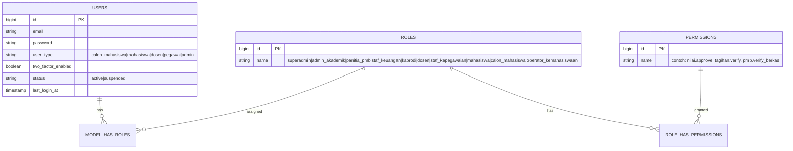
```mermaid
erDiagram
  USERS ||--o{ MODEL_HAS_ROLES : has
  ROLES ||--o{ MODEL_HAS_ROLES : assigned
  ROLES ||--o{ ROLE_HAS_PERMISSIONS : has
  PERMISSIONS ||--o{ ROLE_HAS_PERMISSIONS : granted
  USERS {
    bigint id PK
    string email
    string password
    string user_type "calon_mahasiswa|mahasiswa|dosen|pegawai|admin"
    boolean two_factor_enabled
    string status "active|suspended"
    timestamp last_login_at
  }
  ROLES {
    bigint id PK
    string name "superadmin|admin_akademik|panitia_pmb|staf_keuangan|kaprodi|dosen|staf_kepegawaian|mahasiswa|calon_mahasiswa|operator_kemahasiswaan"
  }
  PERMISSIONS {
    bigint id PK
    string name "contoh: nilai.approve, tagihan.verify, pmb.verify_berkas"
  }
```

**Penting**: `USERS.user_type` menentukan tabel profil mana yang terhubung
(`calon_mahasiswas`, `mahasiswas`, `dosens`, atau `pegawais`) lewat kolom
`user_id` di masing-masing tabel profil — **bukan** satu tabel `users` besar
yang berisi semua kolom biodata. Ini supaya biodata calon mahasiswa dan
mahasiswa aktif tidak tercampur dalam satu baris (lihat alur konversi di PRD §5).

---

## 2. Unit Kerja & Kepegawaian Umum (staf non-dosen)

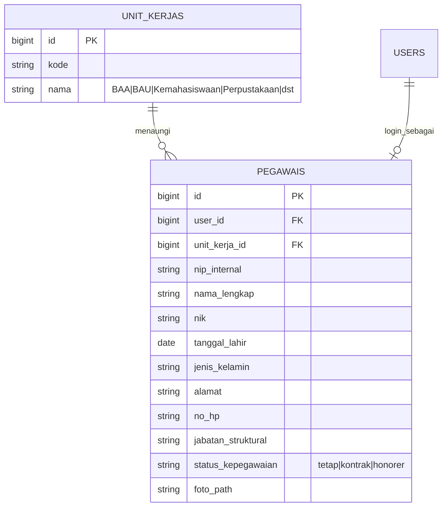
```mermaid
erDiagram
  UNIT_KERJAS ||--o{ PEGAWAIS : menaungi
  USERS ||--o| PEGAWAIS : login_sebagai
  UNIT_KERJAS {
    bigint id PK
    string kode
    string nama "BAA|BAU|Kemahasiswaan|Perpustakaan|dst"
  }
  PEGAWAIS {
    bigint id PK
    bigint user_id FK
    bigint unit_kerja_id FK
    string nip_internal
    string nama_lengkap
    string nik
    date tanggal_lahir
    string jenis_kelamin
    string alamat
    string no_hp
    string jabatan_struktural
    string status_kepegawaian "tetap|kontrak|honorer"
    string foto_path
  }
```

---

## 3. Data Dosen (lengkap)

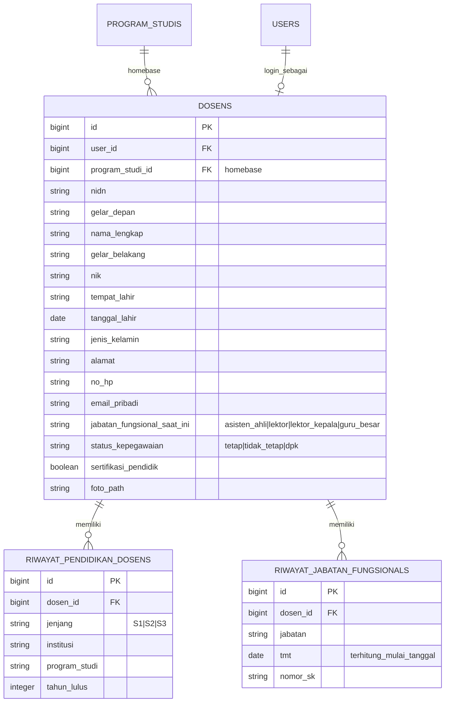
```mermaid
erDiagram
  PROGRAM_STUDIS ||--o{ DOSENS : homebase
  USERS ||--o| DOSENS : login_sebagai
  DOSENS ||--o{ RIWAYAT_PENDIDIKAN_DOSENS : memiliki
  DOSENS ||--o{ RIWAYAT_JABATAN_FUNGSIONALS : memiliki
  DOSENS {
    bigint id PK
    bigint user_id FK
    bigint program_studi_id FK "homebase"
    string nidn
    string gelar_depan
    string nama_lengkap
    string gelar_belakang
    string nik
    string tempat_lahir
    date tanggal_lahir
    string jenis_kelamin
    string alamat
    string no_hp
    string email_pribadi
    string jabatan_fungsional_saat_ini "asisten_ahli|lektor|lektor_kepala|guru_besar"
    string status_kepegawaian "tetap|tidak_tetap|dpk"
    boolean sertifikasi_pendidik
    string foto_path
  }
  RIWAYAT_PENDIDIKAN_DOSENS {
    bigint id PK
    bigint dosen_id FK
    string jenjang "S1|S2|S3"
    string institusi
    string program_studi
    integer tahun_lulus
  }
  RIWAYAT_JABATAN_FUNGSIONALS {
    bigint id PK
    bigint dosen_id FK
    string jabatan
    date tmt "terhitung_mulai_tanggal"
    string nomor_sk
  }
```

**Catatan**: `jabatan_fungsional_saat_ini` di tabel utama adalah cache dari
baris terakhir `riwayat_jabatan_fungsionals` (untuk query cepat), tapi histori
lengkap tetap disimpan — dibutuhkan untuk syarat pembimbing skripsi/penguji
yang biasanya mensyaratkan jenjang jabatan tertentu.

---

## 4. Data Mahasiswa (lengkap)

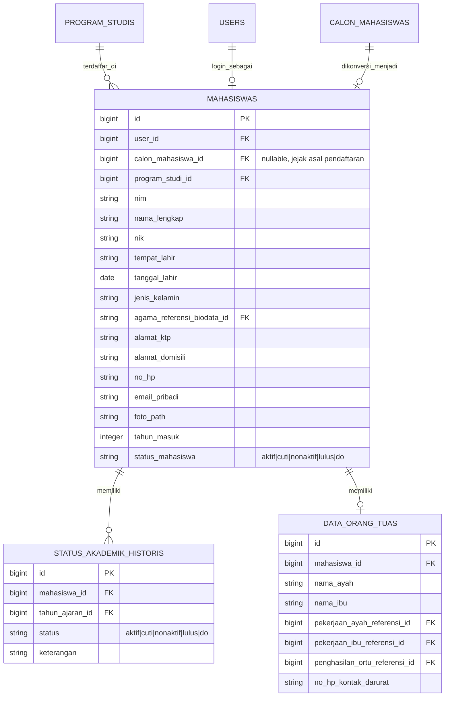
```mermaid
erDiagram
  PROGRAM_STUDIS ||--o{ MAHASISWAS : terdaftar_di
  USERS ||--o| MAHASISWAS : login_sebagai
  CALON_MAHASISWAS ||--o| MAHASISWAS : dikonversi_menjadi
  MAHASISWAS ||--o{ STATUS_AKADEMIK_HISTORIS : memiliki
  MAHASISWAS ||--o| DATA_ORANG_TUAS : memiliki
  MAHASISWAS {
    bigint id PK
    bigint user_id FK
    bigint calon_mahasiswa_id FK "nullable, jejak asal pendaftaran"
    bigint program_studi_id FK
    string nim
    string nama_lengkap
    string nik
    string tempat_lahir
    date tanggal_lahir
    string jenis_kelamin
    string agama_referensi_biodata_id FK
    string alamat_ktp
    string alamat_domisili
    string no_hp
    string email_pribadi
    string foto_path
    integer tahun_masuk
    string status_mahasiswa "aktif|cuti|nonaktif|lulus|do"
  }
  DATA_ORANG_TUAS {
    bigint id PK
    bigint mahasiswa_id FK
    string nama_ayah
    string nama_ibu
    bigint pekerjaan_ayah_referensi_id FK
    bigint pekerjaan_ibu_referensi_id FK
    bigint penghasilan_ortu_referensi_id FK
    string no_hp_kontak_darurat
  }
  STATUS_AKADEMIK_HISTORIS {
    bigint id PK
    bigint mahasiswa_id FK
    bigint tahun_ajaran_id FK
    string status "aktif|cuti|nonaktif|lulus|do"
    string keterangan
  }
```

**Catatan penting**: `MAHASISWAS.status_mahasiswa` adalah status **terkini**
(cache), sedangkan `STATUS_AKADEMIK_HISTORIS` menyimpan **riwayat per semester**
— dibutuhkan untuk laporan PD-DIKTI dan validasi cuti/DO. Jangan hanya
mengandalkan kolom status di tabel utama untuk keputusan bisnis semester lalu.

`calon_mahasiswa_id` menghubungkan ke riwayat pendaftaran PMB (§5) — nullable
karena data lama/migrasi dari sistem sebelumnya tidak akan punya riwayat PMB
di sistem ini.

---

## 5. Penerimaan Mahasiswa Baru (PMB)

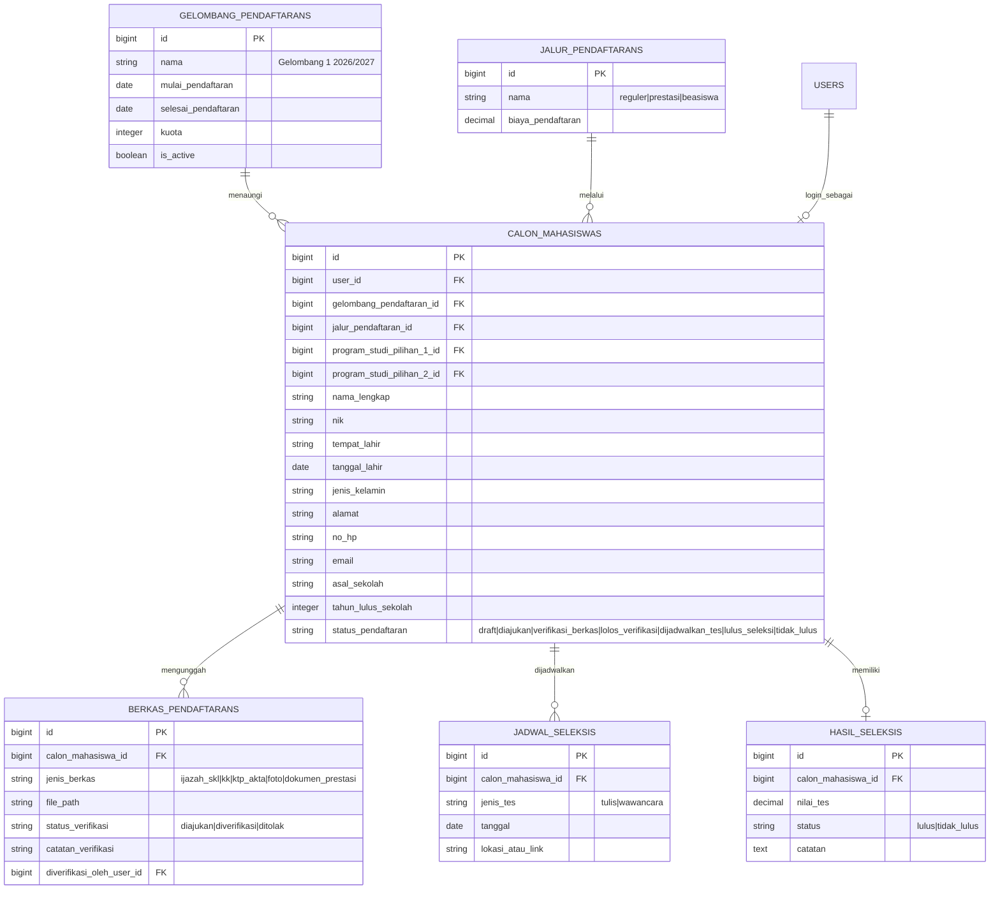
```mermaid
erDiagram
  GELOMBANG_PENDAFTARANS ||--o{ CALON_MAHASISWAS : menaungi
  JALUR_PENDAFTARANS ||--o{ CALON_MAHASISWAS : melalui
  USERS ||--o| CALON_MAHASISWAS : login_sebagai
  CALON_MAHASISWAS ||--o{ BERKAS_PENDAFTARANS : mengunggah
  CALON_MAHASISWAS ||--o{ JADWAL_SELEKSIS : dijadwalkan
  CALON_MAHASISWAS ||--o| HASIL_SELEKSIS : memiliki
  GELOMBANG_PENDAFTARANS {
    bigint id PK
    string nama "Gelombang 1 2026/2027"
    date mulai_pendaftaran
    date selesai_pendaftaran
    integer kuota
    boolean is_active
  }
  JALUR_PENDAFTARANS {
    bigint id PK
    string nama "reguler|prestasi|beasiswa"
    decimal biaya_pendaftaran
  }
  CALON_MAHASISWAS {
    bigint id PK
    bigint user_id FK
    bigint gelombang_pendaftaran_id FK
    bigint jalur_pendaftaran_id FK
    bigint program_studi_pilihan_1_id FK
    bigint program_studi_pilihan_2_id FK
    string nama_lengkap
    string nik
    string tempat_lahir
    date tanggal_lahir
    string jenis_kelamin
    string alamat
    string no_hp
    string email
    string asal_sekolah
    integer tahun_lulus_sekolah
    string status_pendaftaran "draft|diajukan|verifikasi_berkas|lolos_verifikasi|dijadwalkan_tes|lulus_seleksi|tidak_lulus"
  }
  BERKAS_PENDAFTARANS {
    bigint id PK
    bigint calon_mahasiswa_id FK
    string jenis_berkas "ijazah_skl|kk|ktp_akta|foto|dokumen_prestasi"
    string file_path
    string status_verifikasi "diajukan|diverifikasi|ditolak"
    string catatan_verifikasi
    bigint diverifikasi_oleh_user_id FK
  }
  JADWAL_SELEKSIS {
    bigint id PK
    bigint calon_mahasiswa_id FK
    string jenis_tes "tulis|wawancara"
    date tanggal
    string lokasi_atau_link
  }
  HASIL_SELEKSIS {
    bigint id PK
    bigint calon_mahasiswa_id FK
    decimal nilai_tes
    string status "lulus|tidak_lulus"
    text catatan
  }
```

**Catatan**: `CALON_MAHASISWAS.status_pendaftaran` adalah state machine —
transisi harus divalidasi di backend (tidak bisa loncat dari `diajukan`
langsung ke `lulus_seleksi` tanpa lewat verifikasi berkas & jadwal tes). Lihat
alur lengkap di PRD §5.

---

## 6. Registrasi Ulang (Her-registrasi)

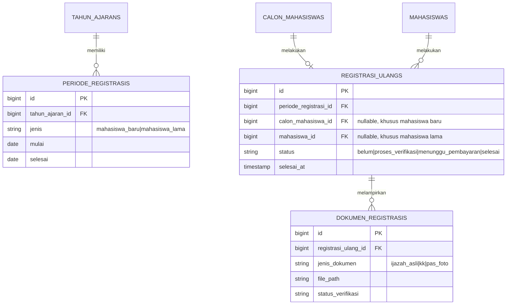
```mermaid
erDiagram
  TAHUN_AJARANS ||--o{ PERIODE_REGISTRASIS : memiliki
  CALON_MAHASISWAS ||--o| REGISTRASI_ULANGS : melakukan
  MAHASISWAS ||--o{ REGISTRASI_ULANGS : melakukan
  REGISTRASI_ULANGS ||--o{ DOKUMEN_REGISTRASIS : melampirkan
  PERIODE_REGISTRASIS {
    bigint id PK
    bigint tahun_ajaran_id FK
    string jenis "mahasiswa_baru|mahasiswa_lama"
    date mulai
    date selesai
  }
  REGISTRASI_ULANGS {
    bigint id PK
    bigint periode_registrasi_id FK
    bigint calon_mahasiswa_id FK "nullable, khusus mahasiswa baru"
    bigint mahasiswa_id FK "nullable, khusus mahasiswa lama"
    string status "belum|proses_verifikasi|menunggu_pembayaran|selesai"
    timestamp selesai_at
  }
  DOKUMEN_REGISTRASIS {
    bigint id PK
    bigint registrasi_ulang_id FK
    string jenis_dokumen "ijazah_asli|kk|pas_foto"
    string file_path
    string status_verifikasi
  }
```

**Catatan**: satu baris `registrasi_ulangs` selalu terisi salah satu dari
`calon_mahasiswa_id` (untuk mahasiswa baru, sekali seumur hidup) atau
`mahasiswa_id` (untuk mahasiswa lama, berulang tiap semester) — tidak pernah
dua-duanya. `status = 'selesai'` adalah salah satu syarat wajib sebelum KRS
bisa dibuka (syarat lainnya: tagihan UKT lunas/cicilan disetujui, lihat §7).

---

## 7. Keuangan & Pembayaran UKT

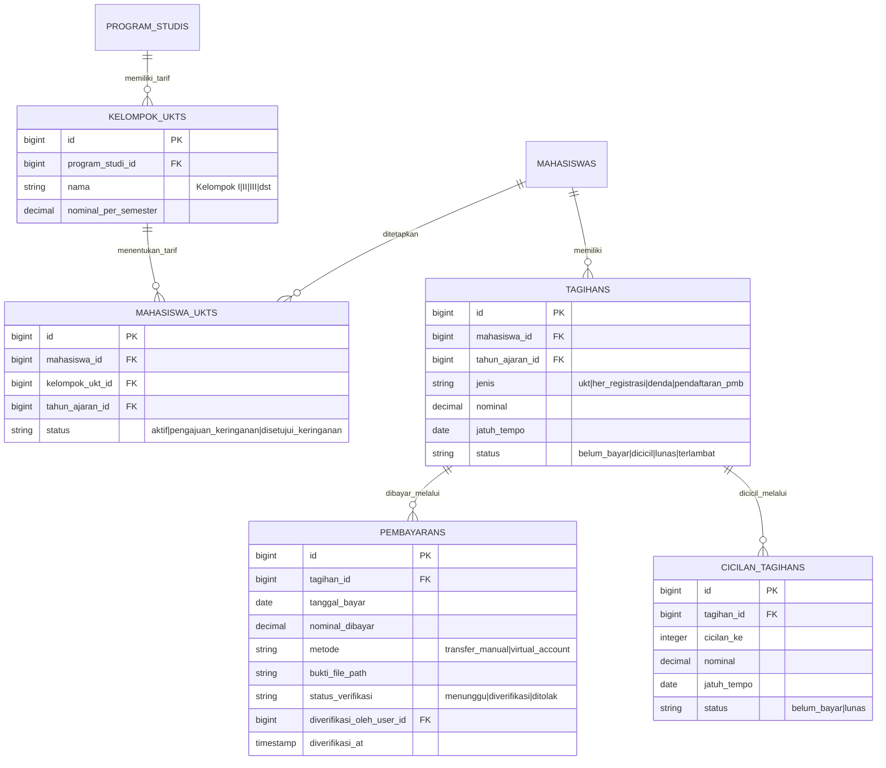
```mermaid
erDiagram
  PROGRAM_STUDIS ||--o{ KELOMPOK_UKTS : memiliki_tarif
  MAHASISWAS ||--o{ MAHASISWA_UKTS : ditetapkan
  KELOMPOK_UKTS ||--o{ MAHASISWA_UKTS : menentukan_tarif
  MAHASISWAS ||--o{ TAGIHANS : memiliki
  TAGIHANS ||--o{ PEMBAYARANS : dibayar_melalui
  TAGIHANS ||--o{ CICILAN_TAGIHANS : dicicil_melalui
  KELOMPOK_UKTS {
    bigint id PK
    bigint program_studi_id FK
    string nama "Kelompok I|II|III|dst"
    decimal nominal_per_semester
  }
  MAHASISWA_UKTS {
    bigint id PK
    bigint mahasiswa_id FK
    bigint kelompok_ukt_id FK
    bigint tahun_ajaran_id FK
    string status "aktif|pengajuan_keringanan|disetujui_keringanan"
  }
  TAGIHANS {
    bigint id PK
    bigint mahasiswa_id FK
    bigint tahun_ajaran_id FK
    string jenis "ukt|her_registrasi|denda|pendaftaran_pmb"
    decimal nominal
    date jatuh_tempo
    string status "belum_bayar|dicicil|lunas|terlambat"
  }
  PEMBAYARANS {
    bigint id PK
    bigint tagihan_id FK
    date tanggal_bayar
    decimal nominal_dibayar
    string metode "transfer_manual|virtual_account"
    string bukti_file_path
    string status_verifikasi "menunggu|diverifikasi|ditolak"
    bigint diverifikasi_oleh_user_id FK
    timestamp diverifikasi_at
  }
  CICILAN_TAGIHANS {
    bigint id PK
    bigint tagihan_id FK
    integer cicilan_ke
    decimal nominal
    date jatuh_tempo
    string status "belum_bayar|lunas"
  }
```

**Catatan penting** (lihat juga `04-Security.md §3` & §4):
- `TAGIHANS.status` **tidak boleh** diubah manual jadi `lunas` langsung dari
  admin panel tanpa ada baris `PEMBAYARANS` yang `status_verifikasi =
  'diverifikasi'` — status ini harus dihitung/diupdate oleh service, bukan
  field yang bisa di-edit bebas.
- Generate baris `TAGIHANS` untuk UKT semester berjalan dilakukan lewat queue
  job terjadwal di awal periode registrasi ulang (§6), berdasarkan
  `MAHASISWA_UKTS` yang aktif — bukan input manual satu-satu oleh staf.
- Semua verifikasi pembayaran wajib tercatat di `activity_logs` (siapa
  memverifikasi, kapan, nominal) karena menyangkut uang.

---

## 8. Master Data & Referensi Akademik

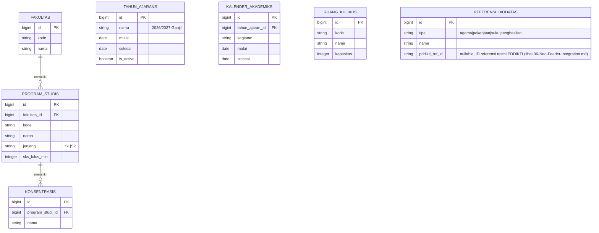
```mermaid
erDiagram
  FAKULTAS ||--o{ PROGRAM_STUDIS : memiliki
  PROGRAM_STUDIS ||--o{ KONSENTRASIS : memiliki
  FAKULTAS {
    bigint id PK
    string kode
    string nama
  }
  PROGRAM_STUDIS {
    bigint id PK
    bigint fakultas_id FK
    string kode
    string nama
    string jenjang "S1|S2"
    integer sks_lulus_min
  }
  KONSENTRASIS {
    bigint id PK
    bigint program_studi_id FK
    string nama
  }
  TAHUN_AJARANS {
    bigint id PK
    string nama "2026/2027 Ganjil"
    date mulai
    date selesai
    boolean is_active
  }
  KALENDER_AKADEMIKS {
    bigint id PK
    bigint tahun_ajaran_id FK
    string kegiatan
    date mulai
    date selesai
  }
  RUANG_KULIAHS {
    bigint id PK
    string kode
    string nama
    integer kapasitas
  }
  REFERENSI_BIODATAS {
    bigint id PK
    string tipe "agama|pekerjaan|suku|penghasilan"
    string nama
    string pddikti_ref_id "nullable, ID referensi resmi PDDIKTI (lihat 06-Neo-Feeder-Integration.md)"
  }
```

**Catatan penyederhanaan**: `REFERENSI_BIODATAS` menggantikan 4 tabel terpisah
di SEVIMA (agama, pekerjaan, suku, penghasilan), dibedakan lewat kolom `tipe`.
Data wilayah disarankan pakai tabel `wilayahs` yang di-seed sekali dari dataset
wilayah Indonesia publik — tabel `wilayahs` juga perlu kolom `pddikti_ref_id`
dengan alasan yang sama.

---

## 9. Kurikulum & Matakuliah

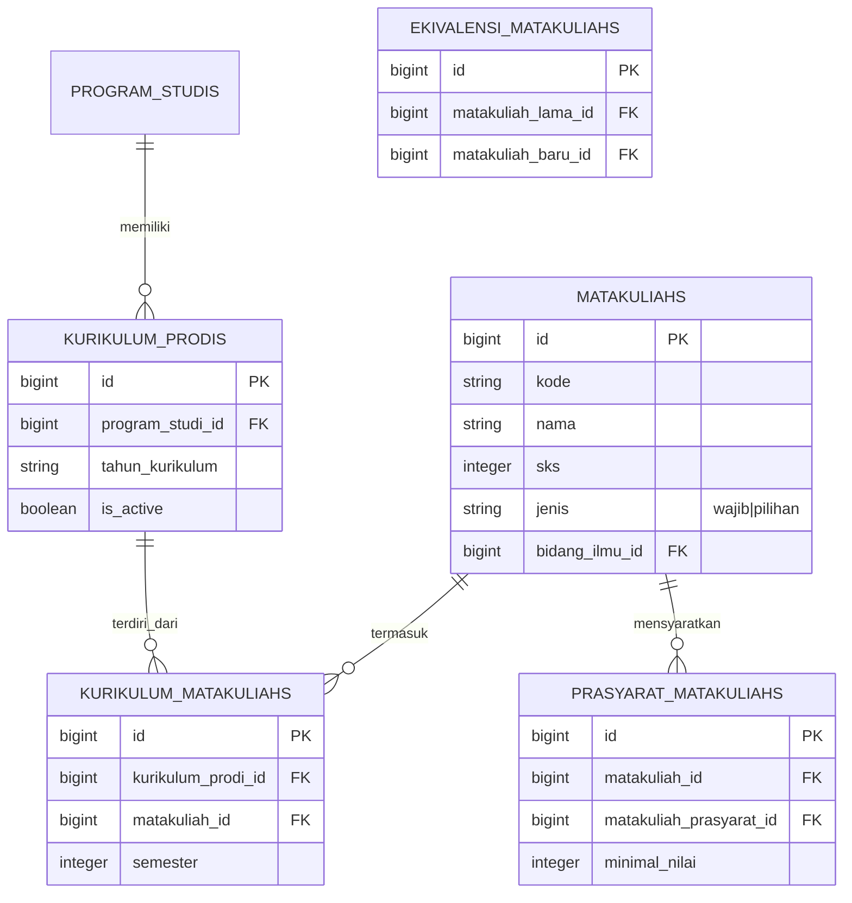
```mermaid
erDiagram
  PROGRAM_STUDIS ||--o{ KURIKULUM_PRODIS : memiliki
  KURIKULUM_PRODIS ||--o{ KURIKULUM_MATAKULIAHS : terdiri_dari
  MATAKULIAHS ||--o{ KURIKULUM_MATAKULIAHS : termasuk
  MATAKULIAHS ||--o{ PRASYARAT_MATAKULIAHS : mensyaratkan
  KURIKULUM_PRODIS {
    bigint id PK
    bigint program_studi_id FK
    string tahun_kurikulum
    boolean is_active
  }
  MATAKULIAHS {
    bigint id PK
    string kode
    string nama
    integer sks
    string jenis "wajib|pilihan"
    bigint bidang_ilmu_id FK
  }
  KURIKULUM_MATAKULIAHS {
    bigint id PK
    bigint kurikulum_prodi_id FK
    bigint matakuliah_id FK
    integer semester
  }
  PRASYARAT_MATAKULIAHS {
    bigint id PK
    bigint matakuliah_id FK
    bigint matakuliah_prasyarat_id FK
    integer minimal_nilai
  }
  EKIVALENSI_MATAKULIAHS {
    bigint id PK
    bigint matakuliah_lama_id FK
    bigint matakuliah_baru_id FK
  }
```

---

## 10. Kelas Kuliah & Jadwal

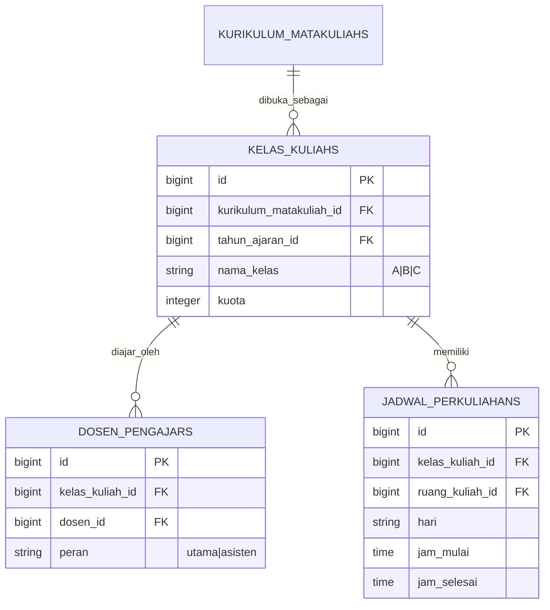
```mermaid
erDiagram
  KURIKULUM_MATAKULIAHS ||--o{ KELAS_KULIAHS : dibuka_sebagai
  KELAS_KULIAHS ||--o{ DOSEN_PENGAJARS : diajar_oleh
  KELAS_KULIAHS ||--o{ JADWAL_PERKULIAHANS : memiliki
  KELAS_KULIAHS {
    bigint id PK
    bigint kurikulum_matakuliah_id FK
    bigint tahun_ajaran_id FK
    string nama_kelas "A|B|C"
    integer kuota
  }
  DOSEN_PENGAJARS {
    bigint id PK
    bigint kelas_kuliah_id FK
    bigint dosen_id FK
    string peran "utama|asisten"
  }
  JADWAL_PERKULIAHANS {
    bigint id PK
    bigint kelas_kuliah_id FK
    bigint ruang_kuliah_id FK
    string hari
    time jam_mulai
    time jam_selesai
  }
```

---

## 11. Perwalian & KRS

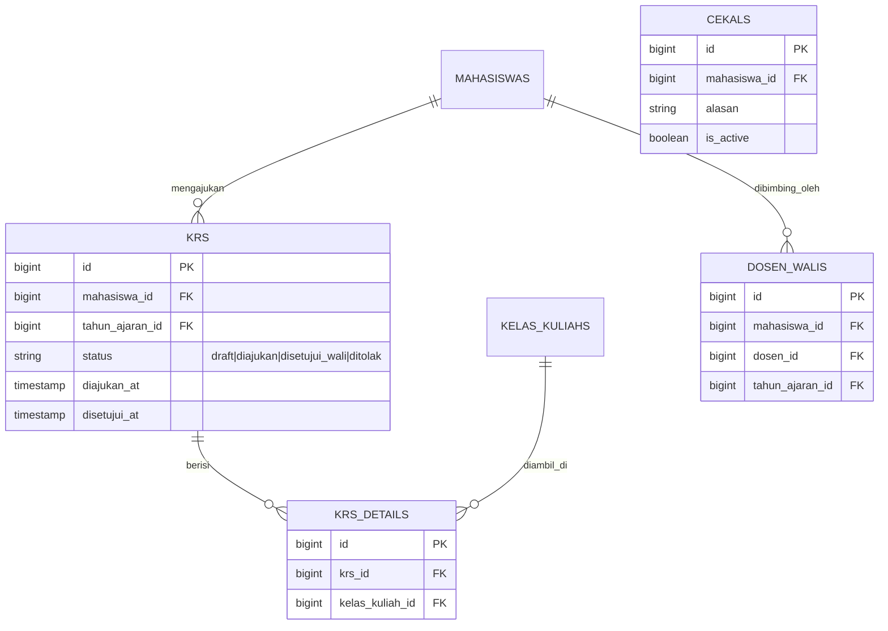
```mermaid
erDiagram
  MAHASISWAS ||--o{ KRS : mengajukan
  KRS ||--o{ KRS_DETAILS : berisi
  KELAS_KULIAHS ||--o{ KRS_DETAILS : diambil_di
  MAHASISWAS ||--o{ DOSEN_WALIS : dibimbing_oleh
  KRS {
    bigint id PK
    bigint mahasiswa_id FK
    bigint tahun_ajaran_id FK
    string status "draft|diajukan|disetujui_wali|ditolak"
    timestamp diajukan_at
    timestamp disetujui_at
  }
  KRS_DETAILS {
    bigint id PK
    bigint krs_id FK
    bigint kelas_kuliah_id FK
  }
  DOSEN_WALIS {
    bigint id PK
    bigint mahasiswa_id FK
    bigint dosen_id FK
    bigint tahun_ajaran_id FK
  }
  CEKALS {
    bigint id PK
    bigint mahasiswa_id FK
    string alasan
    boolean is_active
  }
```

**Catatan v2**: sebelum `KRS` bisa berubah dari `draft` ke `diajukan`, backend
wajib memvalidasi 3 syarat sekaligus:
1. `CEKALS.is_active = false` untuk mahasiswa tsb.
2. `REGISTRASI_ULANGS.status = 'selesai'` untuk tahun ajaran berjalan.
3. `TAGIHANS` (jenis `ukt`) untuk tahun ajaran berjalan berstatus `lunas` atau
   `dicicil` dengan cicilan jatuh tempo terdekat belum lewat.

---

## 12. Realisasi Perkuliahan & Presensi

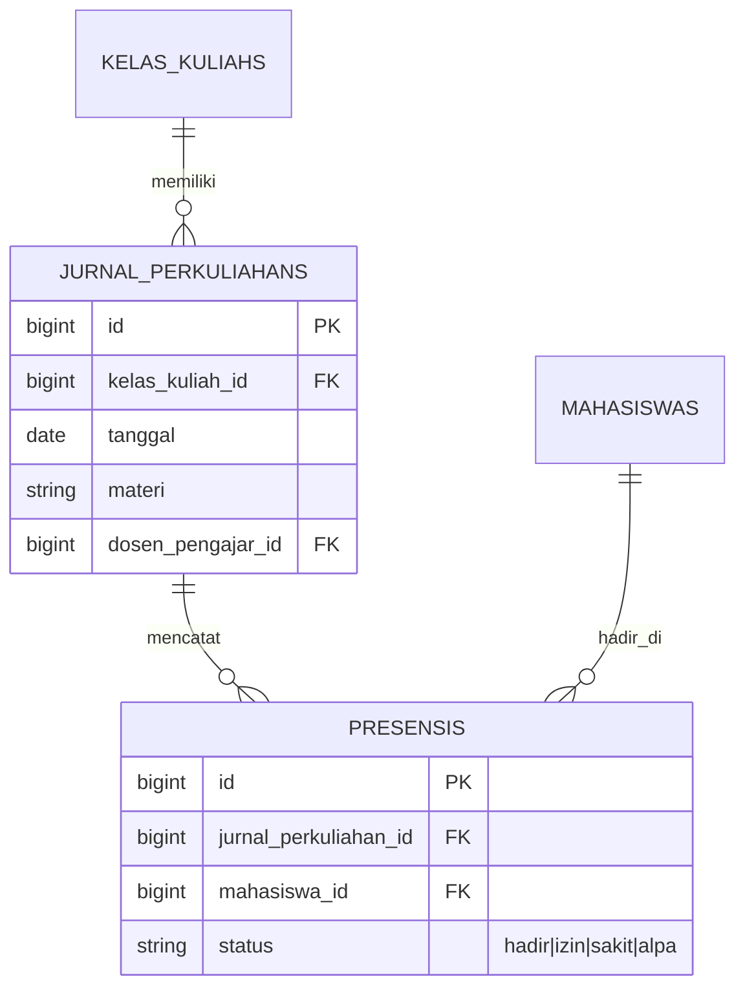
```mermaid
erDiagram
  KELAS_KULIAHS ||--o{ JURNAL_PERKULIAHANS : memiliki
  JURNAL_PERKULIAHANS ||--o{ PRESENSIS : mencatat
  MAHASISWAS ||--o{ PRESENSIS : hadir_di
  JURNAL_PERKULIAHANS {
    bigint id PK
    bigint kelas_kuliah_id FK
    date tanggal
    string materi
    bigint dosen_pengajar_id FK
  }
  PRESENSIS {
    bigint id PK
    bigint jurnal_perkuliahan_id FK
    bigint mahasiswa_id FK
    string status "hadir|izin|sakit|alpa"
  }
```

---

## 13. Penilaian

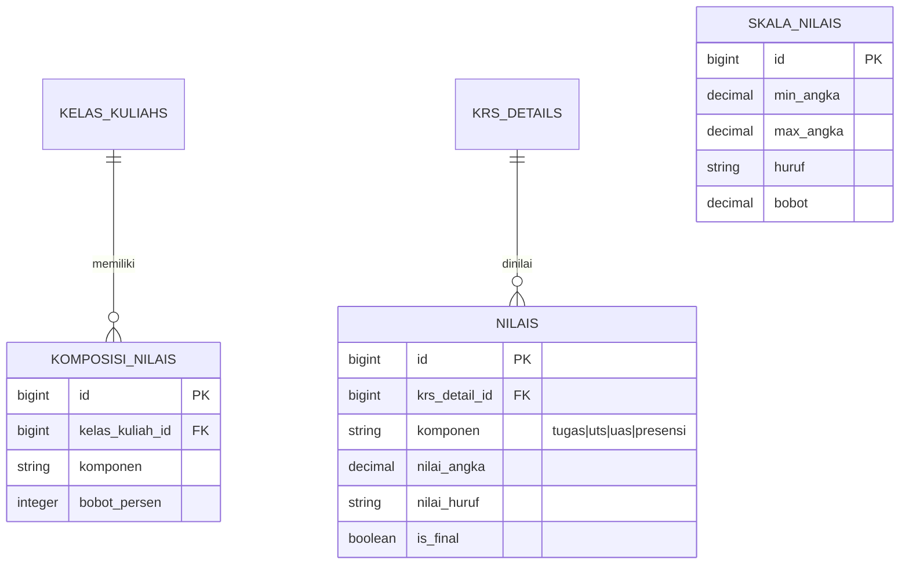
```mermaid
erDiagram
  KELAS_KULIAHS ||--o{ KOMPOSISI_NILAIS : memiliki
  KRS_DETAILS ||--o{ NILAIS : dinilai
  NILAIS {
    bigint id PK
    bigint krs_detail_id FK
    string komponen "tugas|uts|uas|presensi"
    decimal nilai_angka
    string nilai_huruf
    boolean is_final
  }
  KOMPOSISI_NILAIS {
    bigint id PK
    bigint kelas_kuliah_id FK
    string komponen
    integer bobot_persen
  }
  SKALA_NILAIS {
    bigint id PK
    decimal min_angka
    decimal max_angka
    string huruf
    decimal bobot
  }
```

KHS tidak disimpan sebagai tabel terpisah — dihasilkan (cached/generated) dari
agregasi `NILAIS` per mahasiswa per tahun ajaran.

---

## 14. Skripsi & Yudisium

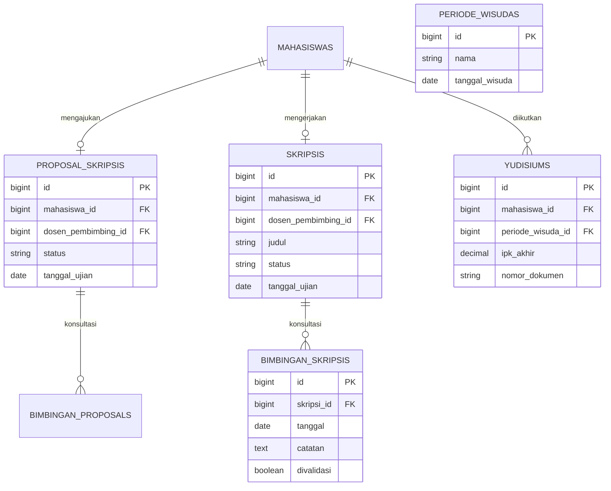
```mermaid
erDiagram
  MAHASISWAS ||--o| PROPOSAL_SKRIPSIS : mengajukan
  PROPOSAL_SKRIPSIS ||--o{ BIMBINGAN_PROPOSALS : konsultasi
  MAHASISWAS ||--o| SKRIPSIS : mengerjakan
  SKRIPSIS ||--o{ BIMBINGAN_SKRIPSIS : konsultasi
  MAHASISWAS ||--o{ YUDISIUMS : diikutkan
  PROPOSAL_SKRIPSIS {
    bigint id PK
    bigint mahasiswa_id FK
    bigint dosen_pembimbing_id FK
    string status
    date tanggal_ujian
  }
  SKRIPSIS {
    bigint id PK
    bigint mahasiswa_id FK
    bigint dosen_pembimbing_id FK
    string judul
    string status
    date tanggal_ujian
  }
  BIMBINGAN_SKRIPSIS {
    bigint id PK
    bigint skripsi_id FK
    date tanggal
    text catatan
    boolean divalidasi
  }
  YUDISIUMS {
    bigint id PK
    bigint mahasiswa_id FK
    bigint periode_wisuda_id FK
    decimal ipk_akhir
    string nomor_dokumen
  }
  PERIODE_WISUDAS {
    bigint id PK
    string nama
    date tanggal_wisuda
  }
```

**Catatan v2**: yudisium/kelulusan seharusnya juga divalidasi terhadap status
keuangan (tidak ada tunggakan UKT aktif) — cek `TAGIHANS` berstatus
`belum_bayar`/`terlambat` sebelum mahasiswa bisa diikutkan `YUDISIUMS`.

---

## 15. Kemahasiswaan

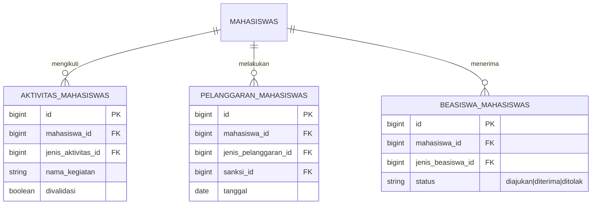
```mermaid
erDiagram
  MAHASISWAS ||--o{ AKTIVITAS_MAHASISWAS : mengikuti
  MAHASISWAS ||--o{ PELANGGARAN_MAHASISWAS : melakukan
  MAHASISWAS ||--o{ BEASISWA_MAHASISWAS : menerima
  AKTIVITAS_MAHASISWAS {
    bigint id PK
    bigint mahasiswa_id FK
    bigint jenis_aktivitas_id FK
    string nama_kegiatan
    boolean divalidasi
  }
  PELANGGARAN_MAHASISWAS {
    bigint id PK
    bigint mahasiswa_id FK
    bigint jenis_pelanggaran_id FK
    bigint sanksi_id FK
    date tanggal
  }
  BEASISWA_MAHASISWAS {
    bigint id PK
    bigint mahasiswa_id FK
    bigint jenis_beasiswa_id FK
    string status "diajukan|diterima|ditolak"
  }
```

**Catatan**: kalau `beasiswa_mahasiswas.status = 'diterima'`, sebaiknya ada
hook otomatis yang membuat penyesuaian di `MAHASISWA_UKTS` (misal beasiswa
UKT) atau `TAGIHANS` (potongan) — didetailkan lebih lanjut saat modul ini
dikerjakan, dicatat sebagai open question tambahan.

---

## 16. Audit & Sistem

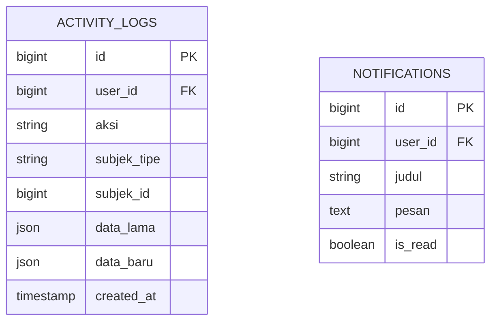
```mermaid
erDiagram
  ACTIVITY_LOGS {
    bigint id PK
    bigint user_id FK
    string aksi
    string subjek_tipe
    bigint subjek_id
    json data_lama
    json data_baru
    timestamp created_at
  }
  NOTIFICATIONS {
    bigint id PK
    bigint user_id FK
    string judul
    text pesan
    boolean is_read
  }
```

Wajib dicatat di `ACTIVITY_LOGS`: perubahan nilai final, approval/rejection
KRS, verifikasi pembayaran, verifikasi berkas PMB, perubahan data referensi,
aktivitas login admin.

---

## 17. Integrasi PD-DIKTI (Neo Feeder)

Detail lengkap ada di `06-Neo-Feeder-Integration.md`. Ringkasan keputusan yang
memengaruhi skema di dokumen ini:

- **Tidak** menambah kolom `pddikti_id` di tiap tabel transaksional
  (`mahasiswas`, `dosens`, `kelas_kuliahs`, `krs`, dst). Sebagai gantinya,
  dipakai satu tabel mapping generik `pddikti_sync_logs` (`entity_type`,
  `entity_id`, `pddikti_id`, `status`, `error_message`, `synced_at`).
- **Pengecualian**: tabel `referensi_biodatas` (§8) mendapat tambahan kolom
  `pddikti_ref_id` — karena ini tabel referensi/master yang memang perlu
  mengacu ke ID referensi resmi PDDIKTI saat push data (bukan tabel
  transaksional, jadi aman ditambah kolom).
- Semua panggilan ke Neo Feeder wajib lewat queue job asinkron, tidak pernah
  langsung di request-response HTTP pengguna.

---

## 18. Ringkasan seluruh tabel (checklist migration)

Gunakan tabel ini untuk cek progres migration — centang saat migration untuk
tabel tsb sudah dibuat & direview:

**Auth & RBAC**: `users`, `roles`, `permissions`, `model_has_roles`,
`role_has_permissions`

**Kepegawaian**: `unit_kerjas`, `pegawais`, `dosens`,
`riwayat_pendidikan_dosens`, `riwayat_jabatan_fungsionals`

**Mahasiswa**: `mahasiswas`, `data_orang_tuas`, `status_akademik_historis`

**PMB**: `gelombang_pendaftarans`, `jalur_pendaftarans`, `calon_mahasiswas`,
`berkas_pendaftarans`, `jadwal_seleksis`, `hasil_seleksis`

**Registrasi ulang**: `periode_registrasis`, `registrasi_ulangs`,
`dokumen_registrasis`

**Keuangan**: `kelompok_ukts`, `mahasiswa_ukts`, `tagihans`, `pembayarans`,
`cicilan_tagihans`

**Master data**: `fakultas`, `program_studis`, `konsentrasis`,
`tahun_ajarans`, `kalender_akademiks`, `ruang_kuliahs`, `referensi_biodatas`,
`wilayahs`

**Kurikulum**: `kurikulum_prodis`, `matakuliahs`, `kurikulum_matakuliahs`,
`prasyarat_matakuliahs`, `ekivalensi_matakuliahs`

**Kelas & jadwal**: `kelas_kuliahs`, `dosen_pengajars`, `jadwal_perkuliahans`

**Perwalian & KRS**: `krs`, `krs_details`, `dosen_walis`, `cekals`

**Realisasi & nilai**: `jurnal_perkuliahans`, `presensis`, `komposisi_nilais`,
`nilais`, `skala_nilais`

**Skripsi & yudisium**: `proposal_skripsis`, `bimbingan_proposals`, `skripsis`,
`bimbingan_skripsis`, `yudisiums`, `periode_wisudas`

**Kemahasiswaan**: `aktivitas_mahasiswas`, `pelanggaran_mahasiswas`,
`beasiswa_mahasiswas`

**Audit & sistem**: `activity_logs`, `notifications`

**Integrasi PD-DIKTI**: `pddikti_sync_logs` (lihat `06-Neo-Feeder-Integration.md`)
