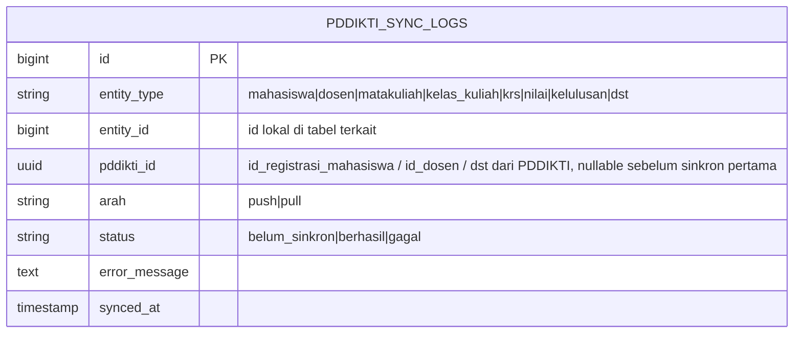

# Integrasi PD-DIKTI (Neo Feeder Web Service) — SIAKAD STAI Al-Yasini

Versi: 1.0 · Berdasarkan: *User Guide Web Service Neo Feeder 2.0* (Ditjen Dikti,
terbit 3 Januari 2023)

Dokumen ini pelengkap dari `02-Database-Schema.md §17` (placeholder) dan
`01-PRD.md §4.12`. Setelah dokumen ini disetujui, kolom/tabel sinkronisasi baru
boleh ditambahkan ke migration.

---

## 1. Apa itu Neo Feeder Web Service (ringkasan yang relevan buat kita)

- Neo Feeder **adalah aplikasi resmi** dari Direktorat Jenderal Pendidikan
  Tinggi (Ditjen Dikti/Kemdikbud) — gratis, di-download dari portal resmi
  `pddikti-admin.kemdikbud.go.id`, dan wajib dipasang oleh tiap perguruan
  tinggi (1 instalasi per kampus) untuk lapor data ke PDDIKTI setiap semester.
  Tersedia installer untuk Windows maupun Linux (multiplatform), jadi bisa
  diinstall di VPS Linux yang sama dengan SIAKAD.
- **Fungsi utamanya justru sebagai lapisan penyangga (buffer)**: API resmi
  PDDIKTI pusat cukup sering berubah — kalau SIAKAD kita bicara langsung ke
  API PDDIKTI pusat, setiap kali API itu berubah, kode SIAKAD kita ikut harus
  diubah. Dengan Neo Feeder di tengah, yang perlu mengikuti perubahan API
  PDDIKTI hanya Neo Feeder (yang di-update oleh Ditjen Dikti sendiri) — SIAKAD
  kita cukup bicara ke Neo Feeder yang kontraknya (fungsi `act=...` di
  dokumen ini) jauh lebih stabil. Ini alasan kenapa modul ini memang harus
  didesain sebagai lapisan terpisah, bukan dicampur ke logic modul lain.
- Neo Feeder juga yang menyimpan **status pengiriman per data** (berhasil/
  gagal beserta alasan gagal) dan memungkinkan **pencocokan data** antara apa
  yang ada di SIAKAD kita dengan apa yang sudah tercatat di PDDIKTI — dua
  kebutuhan ini didetailkan di §4.5 di bawah.
- Semua contoh URL di dokumen resminya memakai `http://localhost:3003/ws/live2.php`
  — satu endpoint tunggal untuk **semua** fungsi, dibedakan lewat parameter
  `act` di request body (gaya RPC, bukan REST per-resource).
- Autentikasi: `act=GetToken` + `username` + `password` → dapat token. Token
  ini dipakai sebagai `bearer {{token}}` di semua request berikutnya.
  Username/password ini **bukan** kredensial SIAKAD kita — ini akun operator
  PDDIKTI resmi milik kampus (lihat §2).
- Ada 2 kategori fungsi:
  - **Get\*** — mengambil data referensi/master (agama, wilayah, prodi, dst)
    dan data yang sudah ada di PDDIKTI (dipakai juga untuk pencocokan data,
    §4.5).
  - **Insert\*/Update\*/Delete\*** — mengirim/mengubah/menghapus data dari
    SIAKAD kita ke PDDIKTI (biodata mahasiswa, penugasan dosen, KRS, nilai,
    kelulusan/DO, dst).
- Field response `Get*` sudah dilengkapi keterangan "Web Service: GetXxx" di
  banyak kolom — artinya banyak field itu **ID referensi PDDIKTI**, bukan ID
  internal kita, dan harus di-mapping (lihat §4).

**Catatan jujur**: dokumentasi resmi menampilkan contoh response sebagai
gambar/screenshot, bukan teks — jadi bentuk JSON envelope persis (nama field
pembungkus seperti `data`/`status`/`message`) perlu **dicek ulang langsung ke
screenshot tiap fungsi di PDF asli saat coding**, jangan diasumsikan sama oleh
Antigravity untuk semua endpoint tanpa verifikasi.

## 2. Soal instalasi — kondisi kampus saat ini & langkah konkret

Kamu menyebut kampus selama ini cuma bayar langganan ke vendor lama, jadi
wajar kalau tidak tahu di mana Neo Feeder terpasang — kemungkinan besar
**vendor lama yang mengelola instalasi Neo Feeder** ini (baik di server
mereka sendiri, atau dulu terpasang di komputer kampus tapi diurus penuh oleh
tim vendor). Ini hal yang lumrah — banyak kampus tidak pernah pegang langsung
instalasi Feeder-nya karena diserahkan ke vendor SIAKAD mereka.

**Kabar baiknya**: akun operator PDDIKTI (yang dipakai untuk `GetToken`)
adalah **milik resmi kampus**, terdaftar di Ditjen Dikti — bukan milik
vendor. Jadi tidak perlu "pindah" apa pun dari vendor lama, kita cukup:

1. **Cari siapa "operator PDDIKTI" resmi di kampus** — biasanya staf BAA yang
   selama ini login ke `pddikti-admin.kemdikbud.go.id` untuk keperluan
   pelaporan semester (kode registrasi, generate prefill, dll). Kemungkinan
   ini orang yang berbeda dari kontak teknis vendor SIAKAD lama.
2. Download **installer Neo Feeder versi Linux (multiplatform)** langsung
   dari `pddikti-admin.kemdikbud.go.id` — resmi, gratis.
3. Install di VPS yang sama dengan SIAKAD (lihat §3 untuk alasan
   keamanannya).
4. Karena kampus **sudah pernah lapor data** lewat vendor lama, data di
   PDDIKTI pusat sudah ada — jadi proses inisiasi di Neo Feeder yang baru ini
   kemungkinan pakai jalur **"migrasi data"** (kalau vendor lama pakai Feeder
   versi lama 4.1 yang bisa disalin) atau **"push prefill"** (generate ulang
   data dari PDDIKTI pusat pakai Kode Registrasi dari menu Pelaporan >
   Generate Prefill di `pddikti-admin.kemdikbud.go.id`) — bukan instalasi
   kosong dari nol. Ini penting supaya data yang sudah dilaporkan
   sebelumnya tidak dianggap hilang/dobel.
5. Kredensial `GetToken` (username/password) untuk operator PDDIKTI ini perlu
   diminta ke staf BAA yang menangani pelaporan PDDIKTI selama ini — bukan
   dibuat baru sembarangan, karena akun ini terikat riwayat pelaporan kampus.

**Yang perlu kamu konfirmasi ke kampus** sebelum instalasi Neo Feeder
dieksekusi:
- Siapa staf yang selama ini jadi operator PDDIKTI (punya akses ke
  `pddikti-admin.kemdikbud.go.id`)?
- Apakah mereka tahu versi Feeder yang dipakai vendor lama (4.1 lama, atau
  sudah Neo Feeder)? Ini menentukan jalur migrasi vs prefill di langkah 4.
- Apakah vendor lama bersedia membantu proses transisi ini (biasanya ada di
  klausul kontrak/SLA saat kampus pindah provider)?

## 3. Rekomendasi arsitektur jaringan (berlaku untuk kedua skenario di §2)

**Prinsip keamanan yang tidak bisa ditawar**: port Web Service Neo Feeder
(default `3003`) **tidak boleh** diekspos ke internet publik. Endpoint
Insert/Update/Delete di dalamnya bisa mengubah data resmi institusi di
PDDIKTI — kalau port ini kebuka ke publik dan token/kredensial bocor, siapa
pun bisa menulis data palsu atas nama kampus ke database pendidikan tinggi
nasional. Ini risiko jauh lebih besar daripada modul lain di SIAKAD ini.

Rekomendasi:
- **Skenario ideal**: Neo Feeder di-install di **VPS/server yang sama** atau
  di jaringan privat yang sama dengan aplikasi SIAKAD, dan port `3003`
  di-bind hanya ke `127.0.0.1` atau interface internal — Laravel app
  memanggilnya lewat `http://127.0.0.1:3003/ws/live2.php` atau IP privat,
  tidak pernah lewat domain publik.
- **Kalau Neo Feeder sudah terlanjur berjalan di komputer terpisah di kampus**
  (bukan di VPS yang sama): jangan buka port 3003 ke internet. Gunakan
  **VPN site-to-site atau tunnel (WireGuard/Tailscale)** antara VPS dan
  jaringan kampus, diinisiasi dari sisi kampus (karena jaringan kampus
  biasanya di belakang NAT/IP dinamis, tidak bisa menerima koneksi masuk
  langsung dari VPS).
- Simpan kredensial (`username`/`password` GetToken) di `.env`, **tidak**
  hardcode di kode — sesuai `04-Security.md §3`.

Ini menjawab sekaligus keputusan yang sempat ditunda sebelumnya (modul
terisolasi vs service terpisah): terlepas dari itu, **isolasi jaringan** untuk
Neo Feeder ini wajib, karena sifatnya yang berbeda dari modul lain (menyentuh
sistem eksternal nasional, bukan cuma data internal kampus).

## 4. Desain sinkronisasi di sisi SIAKAD

### 4.1 Tabel mapping generik (bukan menambah kolom di tiap tabel)

Daripada menambahkan kolom `pddikti_id` di setiap tabel (`mahasiswas`,
`dosens`, `matakuliahs`, `kelas_kuliahs`, `krs`, dst — akan jadi puluhan
migration terpisah dan gampang lupa), dipakai satu tabel mapping generik:

`entity_type` + `entity_id` menunjuk ke baris di tabel manapun (mahasiswas,
dosens, dst) — mirip pola polymorphic relation Laravel. Ini memudahkan audit
"data apa saja yang belum tersinkron" lewat satu tabel, tanpa mengubah skema
tabel inti yang sudah di-migrate.

### 4.2 Kategori sinkronisasi & strategi per kategori

| Kategori | Contoh fungsi Neo Feeder | Strategi |
|---|---|---|
| **Referensi/dictionary** (read-only, jarang berubah) | `GetAgama`, `GetWilayah`, `GetProdi`, `GetJenjangPendidikan`, dll (puluhan fungsi `Get*` referensi) | Tarik sekali di awal (seed), refresh berkala (mis. mingguan) lewat scheduled job — **bukan** dipanggil real-time tiap kali form dibuka |
| **Profil dosen** | `GetListDosen`, `InsertDosenPengajarKelasKuliah`, dll | Push saat data dosen dibuat/diubah di SIAKAD — lewat **queue job**, tidak sinkron langsung di request HTTP (supaya form simpan data dosen tidak lambat/gagal gara-gara Neo Feeder sedang down) |
| **Biodata & registrasi mahasiswa** | `InsertBiodataMahasiswa`, `UpdateBiodataMahasiswa`, `InsertMahasiswaLulusDO` | Push saat konversi calon mahasiswa → mahasiswa aktif (lihat PRD §5), dan saat status lulus/DO ditetapkan — queue job dengan retry |
| **Kurikulum & kelas kuliah** | `InsertKelasKuliah`, `InsertMataKuliah`, `GetKurikulum` | Push per semester saat kelas kuliah difinalisasi (bukan per-perubahan kecil harian) |
| **KRS & nilai** | `GetKRSMahasiswa`, `UpdateNilaiPerkuliahanKelas`, `GetRiwayatNilaiMahasiswa` | Push per periode (akhir semester setelah nilai final `is_final = true`), dijadwalkan sebagai batch job — bukan tiap dosen input satu nilai langsung nyinkron |

Prinsip umum: **semua panggilan ke Neo Feeder lewat queue job asinkron**, tidak
pernah langsung di dalam request-response HTTP pengguna. Kalau Neo Feeder
lambat/down, pengguna SIAKAD (dosen input nilai, staf verifikasi PMB) tidak
boleh ikut terhambat.

### 4.3 Error handling & retry

- Setiap panggilan dicatat di `PDDIKTI_SYNC_LOGS` — sukses maupun gagal,
  termasuk pesan error mentah dari Neo Feeder untuk keperluan debug.
- Retry otomatis dengan backoff (mis. 3x percobaan, jeda 5/15/60 menit) untuk
  kegagalan yang sifatnya sementara (timeout, Neo Feeder sedang restart).
- Kegagalan validasi data (field wajib kosong, format NIK salah, dst) **tidak**
  di-retry otomatis — harus muncul di dashboard admin sebagai "perlu perbaikan
  data manual", karena retry berulang tidak akan menyelesaikan masalah data.
- Sediakan dashboard sederhana untuk staf admin akademik: daftar entity yang
  `status = 'gagal'`, alasan gagal, dan tombol "coba sinkron ulang manual"
  setelah data diperbaiki.

### 4.4 Konsistensi dengan alur PMB & keuangan yang sudah didesain

- Field `InsertBiodataMahasiswa` di Neo Feeder mewajibkan `nik`, `nik_ayah`,
  `nik_ibu` — konsisten dengan `DATA_ORANG_TUAS` yang sudah ada di
  `02-Database-Schema.md §4`, tapi **pastikan field ini diisi wajib di form
  PMB/registrasi ulang kita**, bukan opsional, supaya tidak gagal saat
  disinkron nanti.
- Field seperti `id_agama`, `id_wilayah`, `id_pekerjaan_ayah`,
  `id_penghasilan_ortu` di Neo Feeder mengacu ke ID referensi PDDIKTI —
  ini yang membuat tabel `REFERENSI_BIODATAS` kita (§8 skema DB) perlu kolom
  tambahan `pddikti_ref_id` supaya saat push data, kita tahu ID referensi yang
  benar untuk dikirim (bukan ID internal kita). Ini **satu-satunya**
  penambahan kolom langsung ke tabel master yang direkomendasikan (karena
  memang tabel referensi, bukan tabel transaksional, jadi aman diubah).

### 4.5 Dashboard monitoring & rekonsiliasi data (kebutuhan inti modul ini)

Ini bukan fitur tambahan — ini **alasan utama** modul ini dibuat sebagai
lapisan terpisah, jadi wajib ada di MVP:

**a. Monitoring status kirim per data**
- Tabel di admin panel yang menampilkan tiap baris `pddikti_sync_logs`:
  jenis data, kapan dikirim, status (`berhasil`/`gagal`), dan pesan error
  mentah dari Neo Feeder kalau gagal.
- Filter per jenis data (mahasiswa/dosen/nilai/dst), per rentang tanggal, per
  status — supaya staf BAA bisa fokus menyelesaikan yang gagal tanpa harus
  scroll semua data.
- Tombol "kirim ulang" per baris yang gagal, setelah data diperbaiki.

**b. Pencocokan data (rekonsiliasi) SIAKAD vs PDDIKTI**
- Job terjadwal (mis. mingguan) yang **menarik** data dari Neo Feeder lewat
  fungsi `Get*` (contoh: `GetListMahasiswa`, `GetListDosen`,
  `GetRiwayatNilaiMahasiswa`) untuk entity yang sudah pernah di-push, lalu
  membandingkan field-field kunci dengan data lokal di SIAKAD.
- Kalau ada selisih (misalnya nilai di PDDIKTI beda dengan nilai final di
  SIAKAD karena ada perubahan yang belum sempat di-push ulang), tampilkan di
  dashboard sebagai "perlu rekonsiliasi" — **jangan** langsung menimpa data
  lokal SIAKAD secara otomatis dari hasil pencocokan ini, karena SIAKAD kita
  yang jadi sumber kebenaran utama (source of truth); PDDIKTI adalah salinan
  laporan. Selisih ditampilkan untuk ditinjau staf, keputusan menimpa data
  mana tetap manual.
- Hasil rekonsiliasi juga dicatat (tabel `pddikti_sync_logs` bisa dipakai
  ulang dengan `arah = 'pull'` untuk baris pencocokan ini).

**c. Ringkasan/laporan untuk pimpinan**
- Ringkasan tiap semester: berapa persen data mahasiswa/dosen/nilai yang
  berhasil dilaporkan tepat waktu, berapa yang masih tertunda — berguna
  untuk kebutuhan akreditasi maupun audit internal.

- Sinkronisasi dua arah penuh (pull otomatis semua perubahan dari PDDIKTI ke
  SIAKAD kita) — fase awal fokus **push** data dari SIAKAD ke Neo Feeder saja,
  karena itu yang jadi kewajiban pelaporan. Pull hanya dipakai untuk data
  referensi (dictionary).
- Automasi penuh tanpa pengawasan staf — tetap ada dashboard verifikasi
  manual di awal (§4.3) sebelum kita percaya penuh pada proses otomatis,
  mengingat data yang salah kirim ke PDDIKTI cukup merepotkan untuk
  diperbaiki setelahnya.

## 6. Checklist sebelum mulai coding modul ini

- [ ] Identifikasi staf operator PDDIKTI resmi kampus (§2) — bukan kontak
      vendor lama.
- [ ] Konfirmasi ke operator tsb: versi Feeder yang dipakai vendor lama, dan
      apakah proses transisi butuh migrasi data atau push prefill (§2).
- [ ] Kredensial GetToken (akun operator PDDIKTI) didapat & disimpan aman di
      `.env` server produksi (bukan di repo).
- [ ] Neo Feeder versi Linux ter-install di VPS yang sama dengan SIAKAD (atau
      jalur VPN kalau terpaksa terpisah) — port service Neo Feeder
      dipastikan **tidak** ter-expose bebas ke publik tanpa proteksi
      (firewall/whitelist IP minimal), cek dengan `docker compose ps` /
      `netstat`.
- [ ] Migrasi/push prefill data lama berhasil — data mahasiswa/dosen yang
      sudah pernah dilaporkan vendor lama muncul di Neo Feeder baru, tidak
      dianggap data baru dari nol.
- [ ] Migration tabel `pddikti_sync_logs` dibuat.
- [ ] Kolom `pddikti_ref_id` ditambahkan ke `referensi_biodatas` (dan tabel
      referensi lain yang relevan: wilayah, prodi, dll — didaftar saat
      implementasi berdasarkan fungsi `Get*` referensi yang dipakai).
- [ ] Job seeding data referensi (dictionary) dari Neo Feeder dijalankan
      sekali di awal sebelum modul lain yang bergantung padanya (PMB,
      registrasi) dipakai staf.
- [ ] Dashboard monitoring & rekonsiliasi (§4.5) sudah bisa menampilkan
      minimal status berhasil/gagal sebelum modul ini dianggap selesai MVP.
