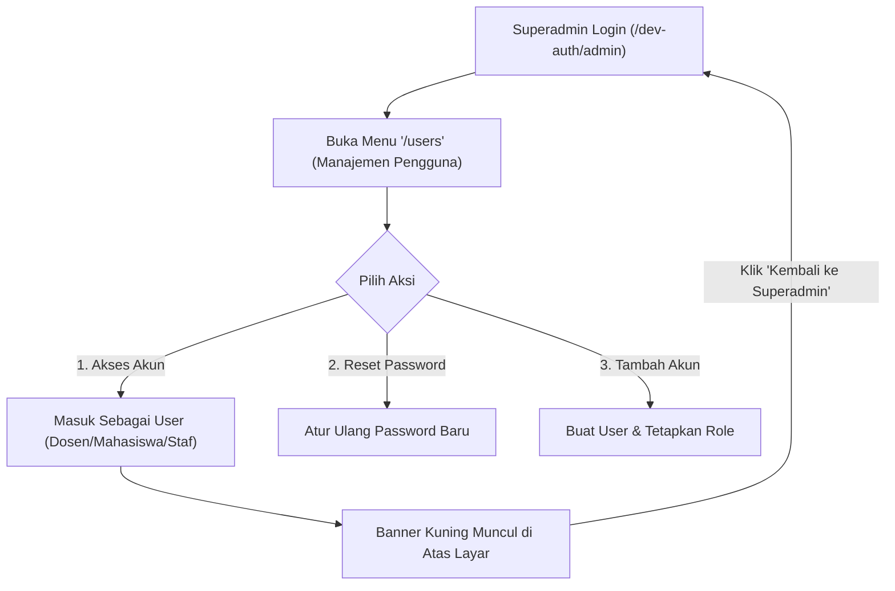

# Panduan Operasional & Catatan Pembaruan Sistem (Changelog)

Dokumen ini mencatat seluruh pembaruan sistem, fitur baru yang telah dibangun, panduan operasional harian, serta panduan bagi Superadmin untuk mengelola dan mengakses seluruh akun pengguna.

---

## 📌 Daftar Isi
1. [Ringkasan Pembaruan Fitur Terbaru](#1-ringkasan-pembaruan-fitur-terbaru)
2. [Panduan Menjalankan Project (Local Development)](#2-panduan-menjalankan-project-local-development)
3. [Fitur Manajemen Pengguna & Akses Akun Superadmin (Impersonation)](#3-fitur-manajemen-pengguna--akses-akun-superadmin-impersonation)
4. [Daftar Akun Pengujian & Shortcut Dev-Auth](#4-daftar-akun-pengujian--shortcut-dev-auth)
5. [Daftar Rute & Fitur Dokumen Cetak Resmi](#5-daftar-rute--fitur-dokumen-cetak-resmi)
6. [Hasil Verifikasi & Pengujian Kualitas](#6-hasil-verifikasi--pengujian-kualitas)

---

## 1. Ringkasan Pembaruan Fitur Terbaru

### A. Manajemen Pengguna & Universal Impersonation (Superadmin)
- **Halaman Manajemen Pengguna (`/users`)**: Menampilkan seluruh data akun civitas akademika dengan filter peran (*Mahasiswa, Dosen, Admin Akademik, Staf Keuangan, Panitia PMB, Staf Kepegawaian, Superadmin*) dan status akun.
- **Fitur Impersonate (Akses Akun Langsung)**: Superadmin dapat masuk (*login*) ke akun pengguna siapa pun (Dosen, Mahasiswa, Staf) dengan 1-klik tanpa perlu mengetahui password mereka.
- **Floating Banner Sesi & Tombol Kembali**: Banner kuning sticky di bagian atas layar menunjukkan akun yang sedang diakses dan menyediakan tombol 1-klik untuk kembali ke akun Superadmin.
- **Reset Password Instan**: Superadmin dapat mengatur ulang password pengguna secara langsung melalui modal dialog.

### B. Upgrade Antarmuka (UI/UX) — Cerah, Ramah Keluarga & Aksesibel
- **Palet Warna Segar & Berwibawa**: Menggunakan kombinasi *Fresh Islamic Emerald Teal* (`#0D7C66`), *Warm Sunny Gold* (`#D97706`), dan latar belakang putih bersih (`#F8FAFC` & `#FFFFFF`) dengan kontras tajam.
- **Ergonomi untuk Dosen Senior & Mahasiswa**:
  - Ukuran teks dan target klik tombol lebih besar dan nyaman (*generous touch target*).
  - Teks berwarna hitam pekat (`#0F172A`) dengan kontras tinggi sehingga tidak membuat mata cepat lelah.
  - Ikon dan label status yang jelas (ramah buta warna / *color-blind safe*).
- **Emblem Identitas STAI Al-Yasini**: Logo baru dengan emblem toga hijau emerald bergradasi dan bintang emas.
- **Redesain Dashboard Utama (`/dashboard`)**: Dilengkapi *Greeting Hero Banner* bernuansa islami (*"Ahlan wa Sahlan, Bapak/Ibu Dosen"* / *"Halo, Rekan Mahasiswa"*), kartu pintasan aksi cepat berdasarkan peran, dan metrik statistik berwarna.
- **Redesain Landing Page Publik (`/`)**: Showcase 3 Program Studi S1 (PAI, Ekonomi Syariah, PGMI), tombol pendaftaran PMB, dan akses masuk akun.

### C. Cetak Dokumen Resmi Akademik (Standar Kopertais/Kemenag)
- **Header Kop Surat Resmi STAI Al-Yasini**: Kop resmi Yayasan Pondok Pesantren Ngalah & STAI Al-Yasini Pasuruan dengan nomor dokumen dinamis dan garis ganda standar.
- **Kartu Rencana Studi (KRS) Resmi (`/dokumen/krs`)**: Layout cetak A4 dengan tabel matakuliah, jadwal kelas, ruang kuliah, dosen pengajar, total SKS, QR Code, dan 3 kolom tanda tangan (Mahasiswa, Dosen Wali, Kaprodi).
- **Kartu Hasil Studi (KHS) Resmi (`/dokumen/khs`)**: Layout cetak A4 dengan rincian nilai, bobot SKS $\times$ Indeks, IPS, IPK kumulatif, dan rekomendasi beban SKS semester depan.
- **Transkrip Akademik Sementara / Lengkap (`/dokumen/transkrip`)**: Rekapitulasi seluruh matakuliah dari semester awal, total SKS lulus, IPK kumulatif, predikat kelulusan (*Cum Laude*, *Sangat Memuaskan*, *Memuaskan*), dan tanda tangan pimpinan.
- **Kartu Peserta Ujian UTS / UAS (`/dokumen/kartu-ujian`)**: Dilengkapi foto 3x4, badge bebas piutang UKT, jadwal & ruang ujian, kolom paraf pengawas, serta tata tertib ujian.
- **Berita Acara Perkuliahan & Rekap Kehadiran (`/dokumen/kelas/{id}/berita-acara`)**: Jurnal tatap muka 16 pertemuan untuk arsip dosen dan fakultas.
- **Proteksi Anti-IDOR**: Mahasiswa dibatasi hanya dapat mencetak dokumen miliknya sendiri.

### D. Modul Kepegawaian & Data Dosen Lengkap
- **Master Unit Kerja (`/kepegawaian/unit-kerja`)**: Pengelolaan unit kerja kampus (BAA, BAU, Perpustakaan, IT, LPPM) dengan proteksi penghapusan data berelasi.
- **Data Pegawai / Staf Non-Dosen (`/kepegawaian/pegawai`)**: Pengelolaan data staf administrasi dan pembuatan akun login otomatis.
- **Data Dosen Lengkap (`/kepegawaian/dosen`)**: Profil dosen, homebase prodi, status sertifikasi dosen (Serdos), riwayat pendidikan (S1/S2/S3), dan kenaikan jabatan fungsional (Asisten Ahli, Lektor, Lektor Kepala, Guru Besar).

### E. Integrasi PD-DIKTI Neo Feeder Web Service 2.0
- **RPC Client & Token Cache**: Koneksi otomatis ke endpoint Neo Feeder 2.0.
- **Asynchronous Queue Jobs**: Sinkronisasi data Mahasiswa, Kelas Kuliah, KRS & Nilai, serta kamus referensi wilayah/biodata.
- **Dashboard Feeder (`/pddikti`)**: Uji koneksi (*Ping*), pemantauan log sinkronisasi, retry failed jobs, dan audit rekonsiliasi data SIAKAD vs PD-DIKTI.

---

## 2. Panduan Menjalankan Project (Local Development)

Jalankan perintah berikut pada terminal WSL Ubuntu:

```bash
# 1. Pastikan PostgreSQL lokal aktif dan jalankan Backend Server
wsl -d Ubuntu bash -c "service postgresql start && cd /home/aphis/Project/siakad-alyasini && php artisan serve"

# 2. Pada terminal terpisah, jalankan Frontend Dev Server (Vite)
wsl -d Ubuntu bash -c "cd /home/aphis/Project/siakad-alyasini && npm run dev"
```

Aplikasi dapat dibuka di browser pada URL: **`http://localhost:8000`**

---

## 3. Fitur Manajemen Pengguna & Akses Akun Superadmin (Impersonation)



### Langkah Mengakses Akun User Lain:
1. Buka `http://localhost:8000/dev-auth/admin` untuk masuk sebagai Superadmin.
2. Masuk ke menu **Sistem & Pengguna $\rightarrow$ Manajemen Pengguna** (`/users`).
3. Cari akun yang ingin diakses (misal mahasiswa tertentu atau dosen wali).
4. Klik tombol **`Akses Akun`**.
5. Sistem akan langsung mengalihkan sesi Anda menjadi user tersebut.
6. Untuk kembali ke Superadmin, klik tombol **`Kembali ke Superadmin`** pada banner kuning di bagian atas layar.

---

## 4. Daftar Akun Pengujian & Shortcut Dev-Auth

Untuk mempercepat pengujian alur kerja tanpa perlu memasukkan password dan kode 2FA secara manual:

| Peran | URL Login Cepat (Dev-Auth) | Email Akun | Keterangan |
|---|---|---|---|
| **Superadmin** | `http://localhost:8000/dev-auth/admin` | `admin@alyasini.ac.id` | Akses penuh seluruh modul & manajemen user |
| **Admin Akademik (BAA)** | `http://localhost:8000/dev-auth/akademik` | `akademik@alyasini.ac.id` | Master data, kurikulum, kelas, jadwal, yudisium |
| **Panitia PMB** | `http://localhost:8000/dev-auth/pmb` | `pmb@alyasini.ac.id` | Verifikasi berkas pendaftar & konversi mahasiswa |
| **Staf Keuangan (BAU)** | `http://localhost:8000/dev-auth/keuangan` | `keuangan@alyasini.ac.id` | Tarif UKT, verifikasi transfer, bebas piutang |
| **Staf Kepegawaian** | `http://localhost:8000/dev-auth/kepegawaian` | `kepegawaian@alyasini.ac.id` | Data dosen, staf, unit kerja, riwayat jabatan |
| **Kaprodi PAI** | `http://localhost:8000/dev-auth/kaprodi` | `kaprodi@alyasini.ac.id` | Monitoring prodi, approval skripsi & kurikulum |
| **Dosen Pengajar** | `http://localhost:8000/dev-auth/dosen` | `dosen@alyasini.ac.id` | Approval KRS wali, presensi 16 sesi, input nilai |
| **Mahasiswa Aktif** | `http://localhost:8000/dev-auth/mahasiswa` | `mahasiswa@alyasini.ac.id` | Pengisian KRS, KHS, cetak kartu ujian & transkrip |
| **Calon Mahasiswa** | `http://localhost:8000/dev-auth/calon` | `calon@alyasini.ac.id` | Portal pendaftaran PMB & upload berkas |
| **Operator Kemahasiswaan** | `http://localhost:8000/dev-auth/kemahasiswaan` | `kemahasiswaan@alyasini.ac.id` | Aktivitas prestasi, pelanggaran, beasiswa |

*Password standar untuk semua akun dummy:* **`password`**

---

## 5. Daftar Rute & Fitur Dokumen Cetak Resmi

| Dokumen | Rute URL | Pengguna yang Berhak |
|---|---|---|
| **Kartu Rencana Studi (KRS)** | `/dokumen/krs` | Mahasiswa bersangkutan, Dosen Wali, Admin |
| **Kartu Hasil Studi (KHS)** | `/dokumen/khs` | Mahasiswa bersangkutan, Dosen Wali, Admin |
| **Transkrip Akademik Sementara** | `/dokumen/transkrip` | Mahasiswa bersangkutan, Admin Akademik |
| **Kartu Peserta Ujian (UTS/UAS)** | `/dokumen/kartu-ujian?jenis=UTS` | Mahasiswa bersangkutan, Admin Akademik |
| **Berita Acara & Presensi Kelas** | `/dokumen/kelas/{id}/berita-acara` | Dosen Pengampu Kelas, Kaprodi, Admin |

---

## 6. Hasil Verifikasi & Pengujian Kualitas

- **Automated Tests**: **147 passed tests (596 assertions)** — 100% lulus.
- **Code Standards**: Seluruh file PHP telah diformat menggunakan **Laravel Pint** (`vendor/bin/pint --format agent`).
- **Frontend Assets**: Terkompilasi bersih tanpa error dengan **Vite** (`npm run build`).
