# Entity Relationship Diagram (ERD) SIAKAD STAI Al-Yasini Pasuruan
## Dokumentasi Resmi Perancangan Basis Data (*Single Source of Truth*)

Dokumen ini memuat arsitektur basis data relasional **SIAKAD STAI Al-Yasini** yang dimodelkan secara presisi berdasarkan 29 tabel migrasi aktif dan 64 Model Eloquent pada basis data MySQL `siakad_db`.

---

## 1. Ikhtisar Arsitektur Basis Data

Sistem Informasi Akademik STAI Al-Yasini dirancang menggunakan arsitektur relasional berintegritas tinggi dengan normalisasi tingkat ketiga (3NF), dilengkapi dengan *foreign key constraint*, indeks teroptimasi, dan enkripsi data sensitif (NIK, NIDN) berbasis algoritma HMAC-SHA256 *blind index*.

### Pengelompokan 7 Domain Inti:
1. **Domain Kelembagaan & Master Data:** Lembaga PT, Fakultas, Program Studi, Tahun Ajaran, Ruang Kuliah.
2. **Domain Pengguna & SDM:** User, Role, Permission, Dosen, Pegawai, Unit Kerja, Dosen Wali.
3. **Domain Penerimaan Mahasiswa Baru (PMB):** Jalur, Gelombang, Calon Mahasiswa, Berkas, Hasil Seleksi.
4. **Domain Kurikulum & Perkuliahan:** Kurikulum, Matakuliah, Prasyarat, Ekivalensi, Kelas Kuliah, Jadwal.
5. **Domain Studi Mahasiswa:** Mahasiswa, Registrasi Ulang, KRS, KRS Detail, Presensi, Jurnal, Nilai, KHS.
6. **Domain Keuangan Akademik:** Kelompok UKT, Komponen Biaya, Tagihan, Cicilan, Pembayaran, Kasir.
7. **Domain Tugas Akhir & Kemahasiswaan:** Proposal Skripsi, Bimbingan Skripsi, Yudisium, Aktivitas, Beasiswa.

---

## 2. Diagram ERD Sistem (Mermaid Relational Format)

```mermaid
erDiagram
    %% ====================================================
    %% 1. KELEMBAGAAN & MASTER DATA
    %% ====================================================
    perguruan_tinggis ||--o{ fakultas : "memiliki"
    fakultas ||--o{ program_studis : "menaungi"
    program_studis ||--o{ setting_prodis : "dikonfigurasi"
    program_studis ||--o{ kurikulum_prodis : "menerapkan"
    program_studis ||--o{ dosens : "homebase"
    program_studis ||--o{ mahasiswas : "terdaftar"
    tahun_ajarans ||--o{ kelas_kuliahs : "periode"
    tahun_ajarans ||--o{ krs : "semester"
    tahun_ajarans ||--o{ tagihans : "tahun_buku"
    ruang_kuliahs ||--o{ jadwal_perkuliahans : "tempat"

    %% ====================================================
    %% 2. CIVITAS & HAK AKSES
    %% ====================================================
    users ||--o| dosens : "profil_dosen"
    users ||--o| pegawais : "profil_pegawai"
    users ||--o| mahasiswas : "profil_mahasiswa"
    users ||--o| calon_mahasiswas : "profil_calon"
    dosens ||--o{ dosen_walis : "membimbing"
    dosens ||--o{ dosen_pengajars : "mengampu"
    dosens ||--o{ bimbingan_skripsis : "membina"
    mahasiswas ||--o| dosen_walis : "memiliki_wali"

    %% ====================================================
    %% 3. PENERIMAAN MAHASISWA BARU (PMB)
    %% ====================================================
    jalur_pendaftarans ||--o{ calon_mahasiswas : "jalur"
    gelombang_pendaftarans ||--o{ calon_mahasiswas : "gelombang"
    calon_mahasiswas ||--o{ berkas_pendaftarans : "mengunggah"
    calon_mahasiswas ||--o| hasil_seleksis : "dinilai"
    calon_mahasiswas ||--o| mahasiswas : "dikonversi_nim"

    %% ====================================================
    %% 4. AKADEMIK, KELAS, & PERKULIAHAN
    %% ====================================================
    kurikulum_prodis ||--o{ kurikulum_matakuliahs : "memuat"
    matakuliahs ||--o{ kurikulum_matakuliahs : "tercantum"
    kurikulum_matakuliahs ||--o{ kelas_kuliahs : "dibuka"
    kelas_kuliahs ||--o{ dosen_pengajars : "dosen"
    kelas_kuliahs ||--o{ jadwal_perkuliahans : "jadwal"
    kelas_kuliahs ||--o{ jurnal_perkuliahans : "pertemuan"
    jurnal_perkuliahans ||--o{ presensis : "kehadiran"

    %% ====================================================
    %% 5. KRS, PERWALIAN, & NILAI
    %% ====================================================
    mahasiswas ||--o{ krs : "mengontrak"
    krs ||--o{ krs_details : "rincian_mk"
    kelas_kuliahs ||--o{ krs_details : "peserta"
    krs_details ||--o| nilais : "hasil_evaluasi"
    krs_details ||--o{ presensis : "rekap_absen"
    kelas_kuliahs ||--o{ komposisi_nilais : "bobot_evaluasi"

    %% ====================================================
    %% 6. KEUANGAN & PEMBAYARAN
    %% ====================================================
    kelompok_ukts ||--o{ mahasiswas : "golongan"
    komponen_biayas ||--o{ tagihans : "jenis_biaya"
    mahasiswas ||--o{ tagihans : "kewajiban"
    tagihans ||--o{ cicilan_tagihans : "termin"
    tagihans ||--o{ pembayarans : "pelunasan"

    %% ====================================================
    %% 7. TUGAS AKHIR & KELULUSAN
    %% ====================================================
    mahasiswas ||--o{ proposal_skripsis : "mengajukan"
    proposal_skripsis ||--o{ bimbingan_proposals : "konsultasi"
    mahasiswas ||--o| skripsis : "menyusun"
    skripsis ||--o{ bimbingan_skripsis : "bimbingan"
    mahasiswas ||--o| yudisiums : "kelulusan"

    %% ====================================================
    %% STRUKTUR ENTITAS UTAMA
    %% ====================================================
    users {
        bigint id PK
        string name
        string email UK
        string user_type "dosen|mahasiswa|pegawai|calon"
        string password
        boolean is_active
        timestamps created_at
    }

    program_studis {
        bigint id PK
        bigint fakultas_id FK
        string kode UK
        string nama
        string jenjang "S1|S2"
        integer sks_lulus_min
    }

    dosens {
        bigint id PK
        bigint user_id FK
        bigint program_studi_id FK
        text nidn
        string nidn_hash UK "HMAC-SHA256"
        string nama_lengkap
        string gelar_depan
        string gelar_belakang
        string status_kepegawaian
    }

    mahasiswas {
        bigint id PK
        bigint user_id FK
        bigint program_studi_id FK
        bigint kelompok_ukt_id FK
        string nim UK
        string nama_lengkap
        integer angkatan
        string status_mahasiswa "aktif|cuti|lulus|do"
    }

    matakuliahs {
        bigint id PK
        string kode UK
        string nama
        integer sks
        string jenis "wajib|pilihan"
    }

    kelas_kuliahs {
        bigint id PK
        bigint tahun_ajaran_id FK
        bigint kurikulum_matakuliah_id FK
        string nama_kelas
        integer kapasitas
        integer jumlah_peserta
    }

    krs {
        bigint id PK
        bigint mahasiswa_id FK
        bigint tahun_ajaran_id FK
        integer total_sks
        string status "draft|diajukan|disetujui|ditolak"
        date tanggal_persetujuan
    }

    krs_details {
        bigint id PK
        bigint krs_id FK
        bigint kelas_kuliah_id FK
        string status "aktif|batal"
    }

    nilais {
        bigint id PK
        bigint krs_detail_id FK
        decimal nilai_tugas
        decimal nilai_uts
        decimal nilai_uas
        decimal nilai_akhir
        string nilai_huruf "A|B|C|D|E"
        decimal bobot
        boolean is_published
    }

    tagihans {
        bigint id PK
        bigint mahasiswa_id FK
        bigint komponen_biaya_id FK
        bigint tahun_ajaran_id FK
        decimal nominal
        decimal sisa_tagihan
        string status "belum_bayar|sebagian|lunas"
    }

    pembayarans {
        bigint id PK
        bigint tagihan_id FK
        string kode_transaksi UK
        decimal jumlah_bayar
        string metode_pembayaran
        string status_verifikasi "menunggu|diterima|ditolak"
    }
```

---

## 3. Kamus Relasi & Integritas Kunci (Foreign Keys)

| Entitas Asal | Foreign Key | Entitas Target | Kardinalitas | Aturan Hapus (On Delete) | Deskripsi Hubungan |
| :--- | :--- | :--- | :---: | :---: | :--- |
| `program_studis` | `fakultas_id` | `fakultas(id)` | N : 1 | CASCADE | Satu fakultas menaungi banyak prodi |
| `dosens` | `user_id` | `users(id)` | 1 : 1 | CASCADE | Akun login otentikasi dosen |
| `dosens` | `program_studi_id` | `program_studis(id)`| N : 1 | RESTRICT | Homebase program studi dosen |
| `mahasiswas` | `user_id` | `users(id)` | 1 : 1 | CASCADE | Akun login portal mahasiswa |
| `mahasiswas` | `program_studi_id` | `program_studis(id)`| N : 1 | RESTRICT | Program studi mahasiswa |
| `mahasiswas` | `kelompok_ukt_id` | `kelompok_ukts(id)` | N : 1 | RESTRICT | Golongan biaya kuliah mahasiswa |
| `kelas_kuliahs` | `tahun_ajaran_id` | `tahun_ajarans(id)` | N : 1 | CASCADE | Periode semester perkuliahan |
| `krs` | `mahasiswa_id` | `mahasiswas(id)` | N : 1 | CASCADE | Pengontrak rencana studi |
| `krs` | `tahun_ajaran_id` | `tahun_ajarans(id)` | N : 1 | RESTRICT | Semester rencana studi |
| `krs_details` | `krs_id` | `krs(id)` | N : 1 | CASCADE | Rincian matakuliah dalam KRS |
| `krs_details` | `kelas_kuliah_id` | `kelas_kuliahs(id)` | N : 1 | RESTRICT | Kelas kuliah yang diikuti |
| `nilais` | `krs_detail_id` | `krs_details(id)` | 1 : 1 | CASCADE | Hasil evaluasi per matakuliah |
| `presensis` | `krs_detail_id` | `krs_details(id)` | N : 1 | CASCADE | Kehadiran mahasiswa per pertemuan |
| `tagihans` | `mahasiswa_id` | `mahasiswas(id)` | N : 1 | CASCADE | Tagihan biaya kepada mahasiswa |
| `pembayarans` | `tagihan_id` | `tagihans(id)` | N : 1 | CASCADE | Transaksi pembayaran tagihan |

---

## 4. Keamanan & Enkripsi Data Sensitif (Blind Index)

Untuk memenuhi standar keamanan data pribadi (PDP):
- Data identitas kependudukan (`nik`) dan nomor induk dosen (`nidn`) disimpan dalam bentuk **terenkripsi (*OpenSSL AES-256-CBC*)** pada kolom bertipe `text`.
- Pencarian dan pengecekan unik dilakukan menggunakan kolom hash deterministik **`nik_hash`** dan **`nidn_hash`** yang dihasilkan melalui fungsi HMAC-SHA256 dengan *secret key* terisolasi.
