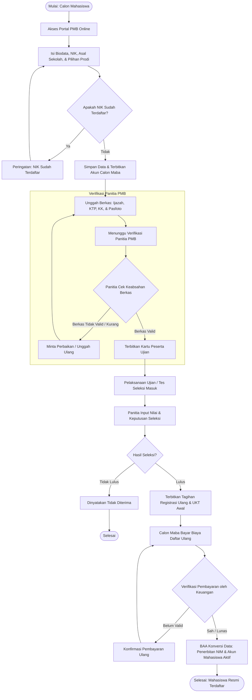
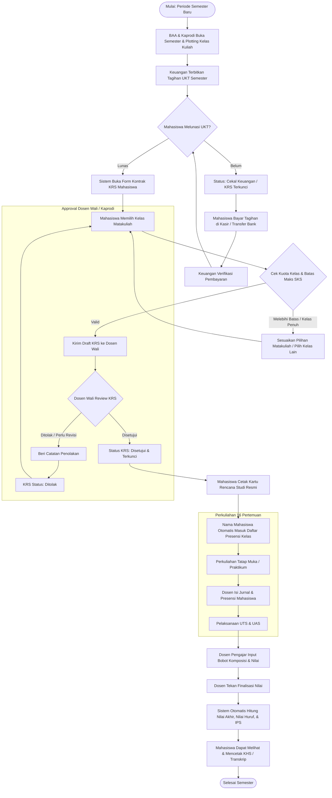

# Flowchart Proses Bisnis SIAKAD STAI Al-Yasini
## Dokumentasi Resmi Prosedur & Alur Operasional (*Single Source of Truth*)

Dokumen ini memuat diagram alir (*flowchart*) proses bisnis akademik terintegrasi di lingkungan **STAI Al-Yasini Pasuruan**, yang mencakup 3 siklus inti: **Penerimaan Mahasiswa Baru (PMB)**, **Perwalian KRS & Perkuliahan**, serta **Tugas Akhir, Skripsi, & Yudisium**.

---

## 1. Flowchart 1: Siklus Penerimaan Mahasiswa Baru (PMB)

---

## 2. Flowchart 2: Siklus Perkuliahan, Perwalian KRS, & KHS

---

## 3. Flowchart 3: Siklus Tugas Akhir, Skripsi, & Yudisium

```mermaid
flowchart TD
    Start3([Mulai: Mahasiswa Semester Akhir]) --> CekSyaratTA{Cek Syarat SKS min. 100 SKS & Lulus Metodologi Penelitian}
    CekSyaratTA -- Belum Terpenuhi --> AmbilMKSyarat[Lengkapi SKS Prasyarat di Semester Aktif] --> End4([Kembali Perkuliahan])
    CekSyaratTA -- Terpenuhi --> AjukanProposal[Mahasiswa Mengajukan Judul & Proposal Skripsi]
    
    AjukanProposal --> ReviewKaprodi{Kaprodi Review Kelayakan Judul}
    ReviewKaprodi -- Ditolak --> RevisiJudul[Ganti Judul / Topik Penelitian] --> AjukanProposal
    ReviewKaprodi -- Diterima --> PlottingPembimbing[Kaprodi Tetapkan Dosen Pembimbing]
    
    PlottingPembimbing --> Sempro[Seminar Proposal Skripsi]
    Sempro --> CekSempro{Lulus Seminar Proposal?}
    CekSempro -- Mengulang --> PerbaikanProposal[Revisi Naskah Proposal] --> Sempro
    CekSempro -- Lulus --> BimbinganRutin[Bimbingan Skripsi & Penelitian Mandiri]
    
    subgraph Proses Bimbingan Skripsi
        BimbinganRutin --> CatatLog[Dosen & Mahasiswa Catat Log Bimbingan]
        CatatLog --> CekLog{Sudah Memenuhi Minimal 8x Bimbingan?}
        CekLog -- Belum --> BimbinganRutin
        CekLog -- Ya --> AccSidang[Dosen Pembimbing Terbitkan ACC Sidang Munaqasyah]
    end

    AccSidang --> DaftarSidang[Daftar Ujian Skripsi / Sidang Munaqasyah]
    DaftarSidang --> ValidasiBerkasSidang{Validasi Bebas SPP & Bebas Pustaka}
    ValidasiBerkasSidang -- Ada Tunggakan --> LunasiKewajiban[Selesaikan Administrasi] --> ValidasiBerkasSidang
    ValidasiBerkasSidang -- Lengkap & Bebas --> JadwalSidang[BAA Terbitkan Jadwal Sidang & Tim Penguji]
    
    JadwalSidang --> SidangSkripsi[Pelaksanaan Sidang Ujian Skripsi]
    SidangSkripsi --> NilaiSidang{Keputusan Sidang?}
    NilaiSidang -- Tidak Lulus --> UjianUlang[Ujian Ulang Skripsi] --> SidangSkripsi
    NilaiSidang -- Lulus dengan Revisi --> SelesaikanRevisi[Perbaikan Naskah & Tanda Tangan Penguji]
    NilaiSidang -- Lulus Murni --> DaftarYudisium[Mahasiswa Mendaftar Yudisium]
    SelesaikanRevisi --> DaftarYudisium

    DaftarYudisium --> SidangYudisium[Rapat Pleno Yudisium Kelulusan]
    SidangYudisium --> TerbitkanIjazah[Penerbitan SK Yudisium, Transkrip Lengkap, & Ijazah]
    TerbitkanIjazah --> Wisuda[Pelaksanaan Wisuda Sarjana]
    Wisuda --> End5([Selesai: Alumni Bergelar Sarjana])
```

---

## 4. Matriks Keterkaitan Antara Use Case dan Flowchart

Setiap tahapan pada flowchart di atas terhubung langsung dengan kode implementasi Controller Laravel dan Route yang aktif:

| Alur Bisnis | Tahapan Flowchart | Use Case Terkait | Controller & Endpoint Teknis |
| :--- | :--- | :--- | :--- |
| **PMB** | Pendaftaran Formulir | `UC1: Pendaftaran PMB` | `PmbPublicController@store` (`/pmb/daftar`) |
| **PMB** | Verifikasi Berkas | `UC1: Validasi PMB` | `CalonMahasiswaController@verifyBerkas` (`/pmb/berkas/{id}/verify`) |
| **PMB** | Konversi Mahasiswa | `UC1: Generate NIM` | `CalonMahasiswaController@konversi` (`/pmb/calon-mahasiswa/{id}/konversi`) |
| **Keuangan**| Pembayaran UKT | `UC5: Bayar Tagihan` | `KeuanganController@submitPayment` (`/keuangan/bayar`) |
| **Keuangan**| Kasir POS | `UC5: Bayar Kasir` | `KasirController@storePayment` (`/keuangan/kasir/bayar`) |
| **Akademik**| Pengisian KRS | `UC3: Kontrak KRS` | `KrsController@submitStudentKrs` (`/krs/saya/submit`) |
| **Akademik**| Approval Dosen Wali | `UC3: Approval KRS` | `KrsController@approveKrs` (`/perwalian/krs/{id}/approve`) |
| **Akademik**| Presensi & Jurnal | `UC4: Presensi Kuliah`| `PresensiController@store` (`/akademik/presensi`) |
| **Akademik**| Finalisasi Nilai | `UC4: Input Nilai` | `PenilaianController@finalize` (`/akademik/penilaian/finalize`) |
| **Kelulusan**| Bimbingan Skripsi | `UC6: Bimbingan TA` | `SkripsiController@storeBimbingan` (`/skripsi/{id}/bimbingan`) |
| **Kelulusan**| Yudisium | `UC7: Kelulusan` | `YudisiumController@store` (`/yudisium`) |
