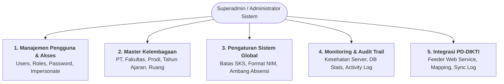

# Panduan Resmi Fitur Superadmin SIAKAD STAI Al-Yasini
## Standar Arsitektur & Logika Bisnis (Referensi: SEVIMA SiakadCloud)

Dokumen ini memuat panduan komprehensif seluruh fitur, fungsi, hak istimewa, dan logika alur kerja (*business logic*) untuk **Role Superadmin (Administrator Sistem)** di lingkungan **SIAKAD STAI Al-Yasini Pasuruan**.

---

## 1. Filosofi & Peran Superadmin dalam Sistem

Dalam ekosistem SIAKAD standar nasional (seperti **SEVIMA SiakadCloud / Edlink**), **Superadmin** adalah pemegang otoritas tertinggi sistem (*Root Administrator*) yang bertanggung jawab atas 4 pilar utama:
1. **Integritas Master Data Lembaga:** Memastikan identitas perguruan tinggi, fakultas, prodi, dan tahun ajaran valid sesuai SK pendirian dan standar PDDikti.
2. **Keamanan & Manajemen Akses Pengguna:** Mengelola kredensial, role Spatie, safeguard akun, dan investigasi kendala via fitur *Impersonate*.
3. **Pengaturan Parameter Operasional Kampus:** Menetapkan formula batas SKS, format penomoran otomatis (NIM/Kwitansi), dan ambang batas presensi.
4. **Pemantauan Kesehatan & Audit Trail:** Mengawasi beban basis data, antrean job, dan merekam jejak rekam (*activity log*) seluruh aksi pengguna.

---

## 2. Struktur Modul & Rincian Fitur Superadmin

---

### MODUL 1: Manajemen Pengguna & Hak Akses (`/users`)
- **Fungsi:** Mengelola seluruh akun login di sistem (10 role resmi: Superadmin, BAA, Dosen, Kaprodi, Mahasiswa, Calon Maba, Keuangan, PMB, Kepegawaian, Kemahasiswaan).
- **Fitur Utama:**
  1. **Tabel Pengguna Terintegrasi:** Menampilkan nama, email, tipe user, role aktif, status (aktif/non-aktif), dan tombol aksi.
  2. **Filter & Pencarian Instan:** Pencarian nama/email serta filter dropdown per role dan per status.
  3. **Tambah & Edit Pengguna:** Form modal pembuatan akun baru dengan validasi otomatis keunikan email dan konsistensi tipe user terhadap role Spatie.
  4. **Reset Password Administrator:** Fitur satu-klik untuk mereset kata sandi pengguna jika pengguna lupa password.
  5. **Fitur Impersonate User (Login Sebagai):**  
     *Logika Sevima:* Superadmin dapat mengklik tombol "Login Sebagai User Ini" untuk masuk ke portal pengguna tersebut tanpa memerlukan kata sandi mereka. Sesi aman dicatat di session `impersonator_id`, banner peringatan kuning muncul di atas layar, dan tombol **"Kembali ke Akun Superadmin"** selalu tersedia.
  6. **Safeguard Proteksi Akun:** Superadmin utama (`admin@alyasini.ac.id`) tidak dapat dinonaktifkan atau dihapus oleh siapapun untuk mencegah sistem terkunci (*lockout*).

---

### MODUL 2: Master Kelembagaan & Organisasi Kampus (`/master/*`)
- **Fungsi:** Mengelola data struktural yayasan dan perguruan tinggi yang menjadi acuan utama seluruh transaksi akademik dan cetak dokumen resmi.
- **Sub-Modul:**
  1. **Profil Perguruan Tinggi (`/master/perguruan-tinggi`):**  
     Mengatur nama resmi institusi, kode PT (Kemenag/Kemendikbud), SK Pendirian, tanggal berdiri, akreditasi institusi, nama Ketua/Rektor, NIDN pimpinan, alamat kampus, email, nomor telepon, dan logo resmi untuk kop surat.
  2. **Data Fakultas (`/master/fakultas`):**  
     Mengatur kode fakultas, nama fakultas (contoh: Fakultas Tarbiyah, Fakultas Syariah), nama Dekan, dan status keaktifan.
  3. **Program Studi (`/master/program-studi`):**  
     Mengatur kode prodi (sesuai DIKTI), nama prodi (contoh: S1 Pendidikan Agama Islam), jenjang (S1/S2), gelar kelulusan (S.Pd, S.E), Kaprodi yang bertugas, SK izin operasional, dan peringkat akreditasi (LAMDIK / BAN-PT).
  4. **Tahun Ajaran & Semester (`/master/tahun-ajaran`):**  
     Mengatur periode tahun akademik (contoh: 2026/2027), semester (Ganjil, Genap, Antara), tanggal mulai & selesai perkuliahan, rentang waktu UTS/UAS, dan **toggle status aktif** (hanya 1 tahun ajaran yang boleh aktif dalam satu waktu).
  5. **Ruang Kuliah & Gedung (`/master/ruang-kuliah`):**  
     Mengatur kode ruangan, nama gedung, kapasitas kursi mahasiswa, dan fasilitas ruangan (AC, LCD Proyektor, Lab Komputer) sebagai acuan plotting jadwal kuliah.
  6. **Referensi Biodata (`/master/referensi-biodata`):**  
     Data master referensi nasional seperti Agama, Jenis Kelamin, Jalur Masuk, Jenis Tinggal, dan Status Mahasiswa.

---

### MODUL 3: Pengaturan Sistem Global (`/settings/system-configs`)
- **Fungsi:** Menetapkan parameter operasional akademik dan aturan main kampus tanpa perlu mengubah kode sumber (*low-code configuration*).
- **Parameter Utama (Whitelist Parameter):**
  1. **Aturan Batas SKS:** Menentukan formula pengambilan SKS mahasiswa berdasarkan Indeks Prestasi Semester (IPS) lalu:
     - IPS $\ge 3.00 \rightarrow$ Maksimal 24 SKS.
     - $2.50 \le \text{IPS} < 3.00 \rightarrow$ Maksimal 22 SKS.
     - $2.00 \le \text{IPS} < 2.50 \rightarrow$ Maksimal 20 SKS.
     - IPS $< 2.00 \rightarrow$ Maksimal 18 SKS.
  2. **Ambang Batas Kehadiran Minimal Kuliah:** Default 75% kehadiran untuk syarat mahasiswa diizinkan mengikuti Ujian Akhir Semester (UAS).
  3. **Format Penomoran Otomatis:**
     - Format penomoran NIM Mahasiswa (contoh: `{TAHUN}{PRODI}{URUT:4}`).
     - Format nomor kwitansi pembayaran (contoh: `KW/{TAHUN}/{BULAN}/{URUT:5}`).
  4. **Status Periode KRS & KHS:** Menentukan apakah gerbang pengisian KRS dan penginputan nilai sedang dibuka atau dikunci secara terpusat.
  5. **Pengaturan Kop Dokumen Cetak:** Judul kop surat resmi, instansi penaung (Yayasan Al-Yasini), dan footer dokumen.

---

### MODUL 4: Pemantauan Sistem & Audit Trail (`/superadmin/monitoring`)
- **Fungsi:** Menyediakan visibilitas waktu-nyata (*real-time dashboard*) mengenai performa server, basis data, dan riwayat jejak rekam pengguna.
- **Komponen Utama:**
  1. **Metrik Basis Data (Entity Counters):** Menghitung secara efisien jumlah pengguna, mahasiswa aktif, dosen, kelas kuliah terbuka, KRS semester aktif, dan volume transaksi keuangan.
  2. **Kesehatan Antrean (Job Queue Status):** Memantau jumlah tugas latar belakang (*pending jobs* dan *failed jobs*) seperti proses sinkronisasi dan pengiriman email.
  3. **Informasi Runtime Server:** Versi PHP (8.4.x), Laravel Framework (13.x), koneksi basis data aktif (MySQL), driver cache, dan driver session.
  4. **Activity Audit Trail (Log Aktivitas):**
     - Merekam setiap aksi penting pengguna: *Waktu*, *Nama Pengguna*, *Aksi (CREATE, UPDATE, DELETE, LOGIN, IMPERSONATE)*, *Entitas yang diubah*, dan *IP Address*.
     - Dilengkapi fitur pencarian kata kunci dan filter tipe aksi.

---

### MODUL 5: Integrasi PD-DIKTI Feeder (`/pddikti`)
- **Fungsi:** Sarana sinkronisasi berkala data kelembagaan, civitas, dan akademik ke pangkalan data Kemenag/Kemendikbudristek melalui Web Service Neo Feeder.
- **Komponen Utama:**
  1. **Uji Konektivitas Feeder:** Tombol ping ke endpoint Web Service Neo Feeder untuk memeriksa token dan status jaringan.
  2. **Tabel Pemetaan (*Mapping* Data):** Memetakan kode internal kampus dengan kode referensi nasional DIKTI (Prodi, Dosen, Mahasiswa, Matakuliah).
  3. **Log & Riwayat Sinkronisasi:** Menampilkan log pengiriman data (waktu kirim, jenis data, jumlah record, status berhasil/gagal, dan pesan balasan feeder).

---

## 3. Rencana Pengerjaan Bertahap (Satu per Satu)

Agar tim dan AI Agent tidak kehilangan arah dan fokus pada kualitas:

| Tahap | Modul yang Dikerjakan | Target & Output |
| :---: | :--- | :--- |
| **Tahap 1** | **Modul Pengaturan Sistem Global (`/settings/system-configs`)** | Rapikan tab kategori konfigurasi (Akademik, KRS, Keuangan, Cetak), validasi tipe data input, dan audit log perubahan. |
| **Tahap 2** | **Modul Manajemen Pengguna & Impersonate (`/users`)** | Optimasi tabel user, filter per role, modal create/edit, reset password, dan perkuat sesi impersonasi aman. |
| **Tahap 3** | **Modul Pemantauan Sistem & Audit Log (`/superadmin/monitoring`)** | Perbaiki query pencarian `ilike` $\rightarrow$ `like` MySQL, optimasi metrik statistik, dan visualisasi activity log. |
| **Tahap 4** | **Modul Master Kelembagaan (`/master/*`)** | Verifikasi dan poles 5 modul master (Perguruan Tinggi, Fakultas, Program Studi, Tahun Ajaran, Ruang Kuliah) agar selaras dengan kop cetak. |
| **Tahap 5** | **Modul Integrasi PD-DIKTI (`/pddikti`)** | Uji alur simulasi sync batch, retry error log, dan rekonsiliasi data. |
| **Tahap 6** | **Verifikasi Akhir & Pengujian Otomatis** | Menjalankan seluruh test suite Pest dan memastikan tidak ada error TypeScript/Vite. |
