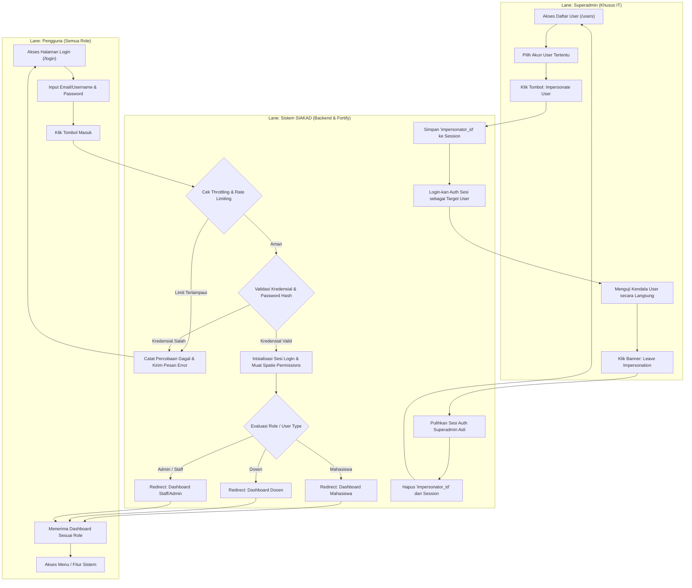
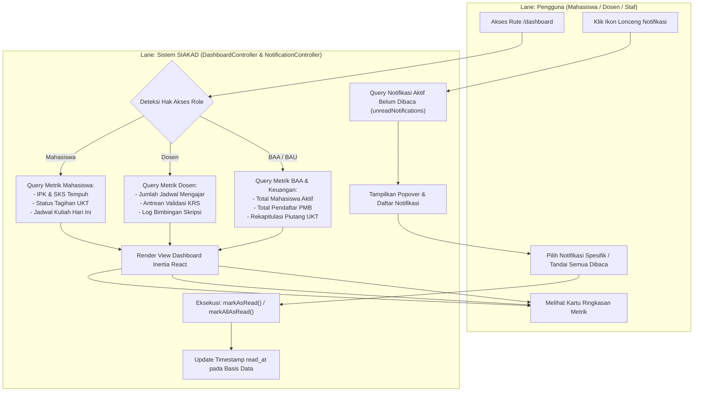
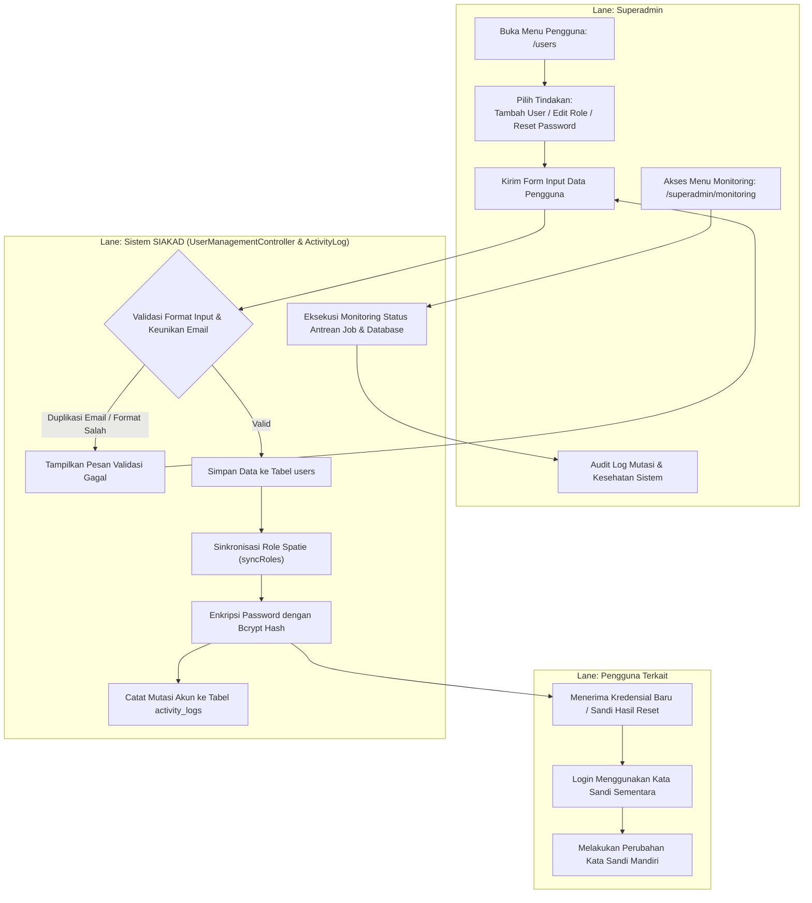
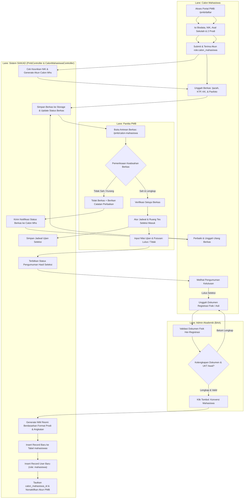
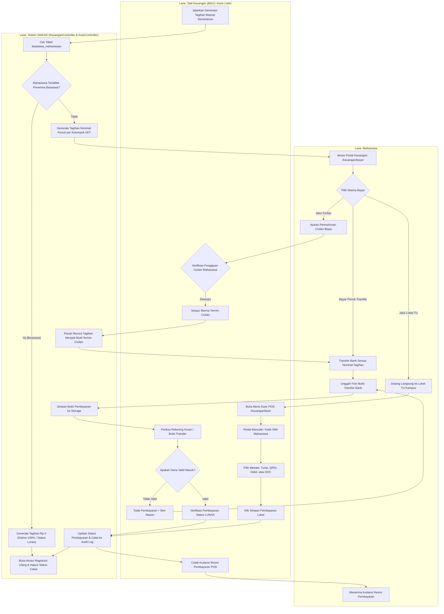
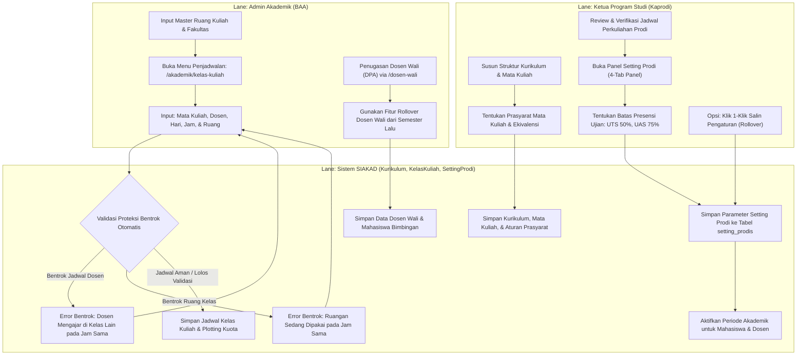
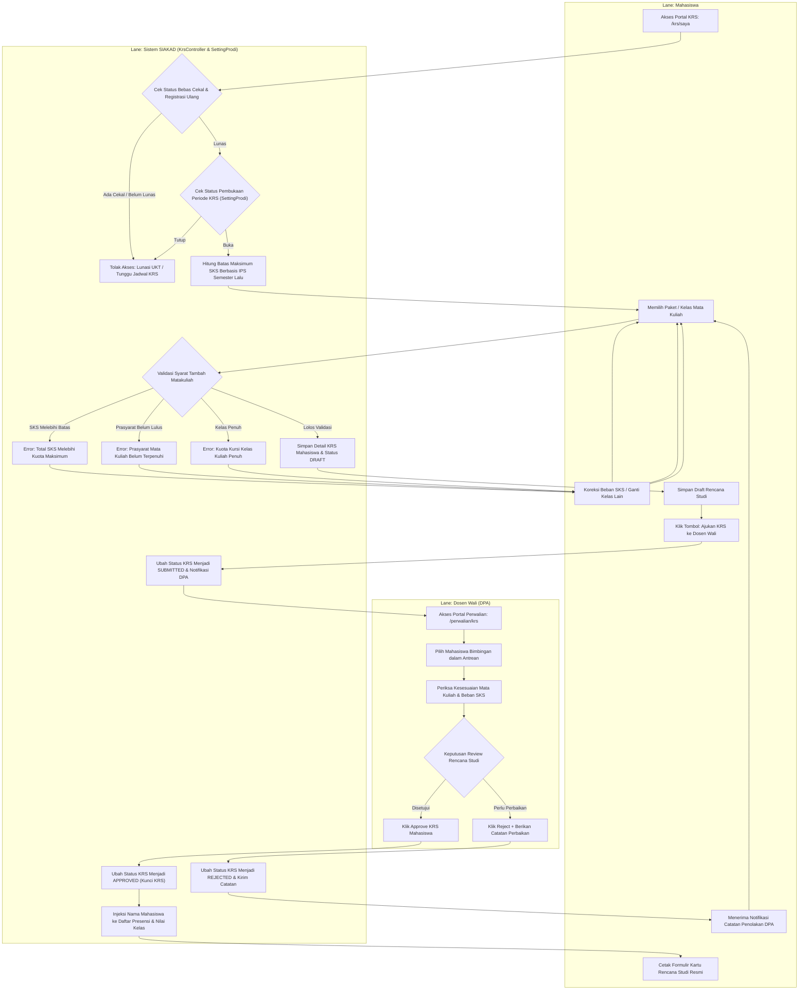
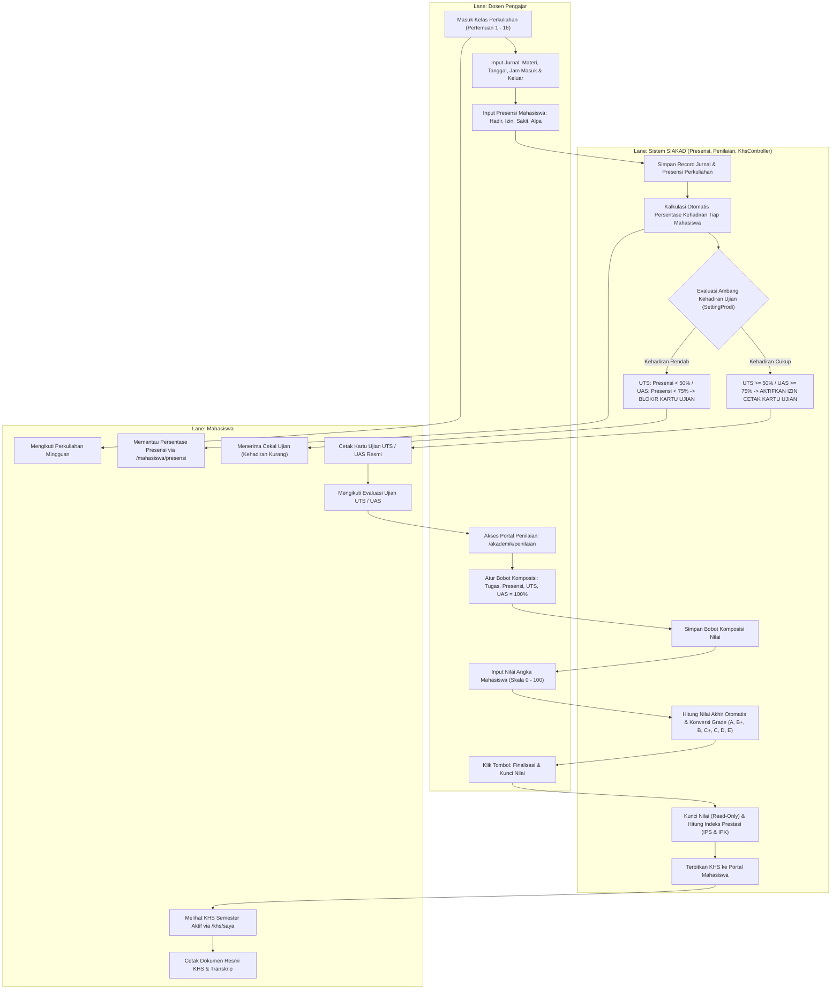
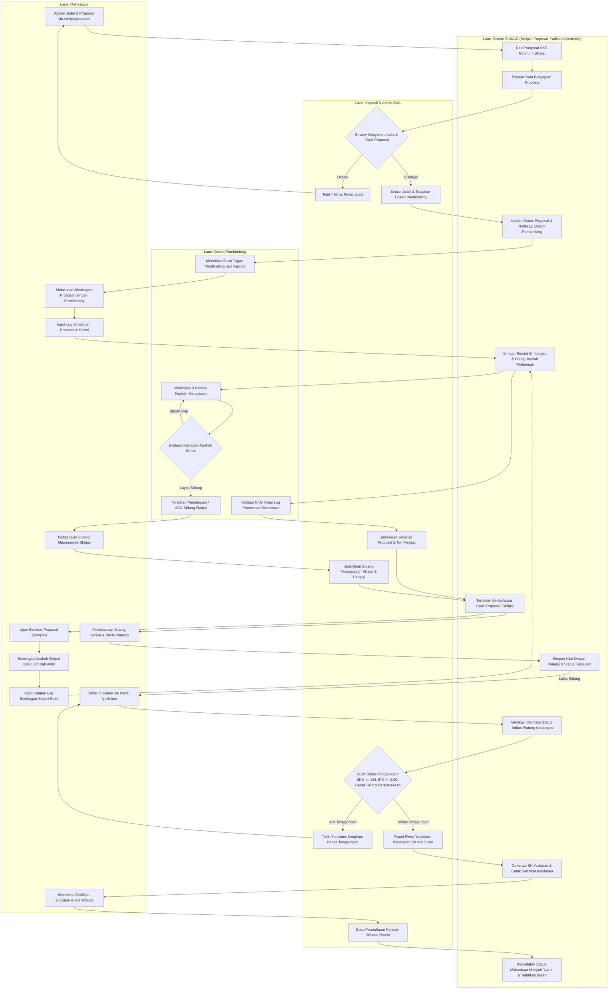
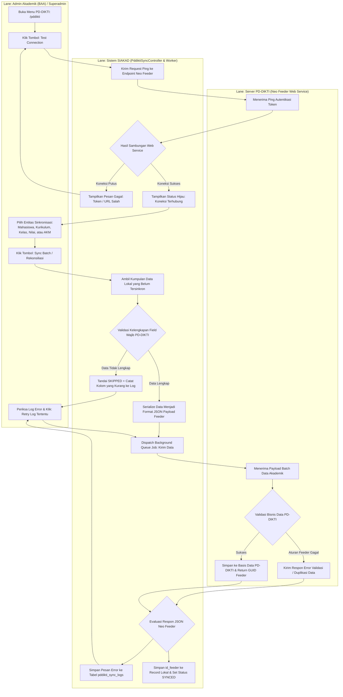

# Dokumentasi Swimlane Flowchart (Diagram Alur Lintas Fungsi)
## Sistem Informasi Akademik (SIAKAD) STAI Al-Yasini Pasuruan

Dokumen ini memetakan seluruh prosedur operasional dan alur kerja lintas fungsi (*Cross-Functional / Swimlane Workflow*) pada aplikasi **SIAKAD STAI Al-Yasini**. Setiap diagram memisahkan tanggung jawab antara aktor/peran pengguna (**Role/User**) dengan pemrosesan otomatis di sisi sistem (**Sistem SIAKAD**).

---

## Daftar Role yang Terlibat dalam Sistem

Sistem mengimplementasikan 10 peran pengguna resmi sesuai dengan otorisasi berbasis Spatie Permission & Fortify:
1. **Superadmin**: Tim IT pengelola infrastruktur, audit log, monitoring sistem, dan manajemen user/impersonasi.
2. **Admin Akademik (BAA)**: Staf Biro Administrasi Akademik pengelola master data, kurikulum, plotting kelas, konversi mahasiswa, dan cetak dokumen resmi.
3. **Kaprodi**: Ketua Program Studi penanggung jawab kurikulum prodi, persetujuan proposal skripsi, dan konfigurasi setting prodi.
4. **Dosen**: Dosen pengajar, dosen pembimbing akademik (DPA/Wali), dan dosen pembimbing skripsi.
5. **Mahasiswa**: Peserta didik aktif pengontrak KRS, pemantau perkuliahan, pembayar UKT, dan pendaftar tugas akhir.
6. **Calon Mahasiswa**: Akun pendaftar jalur PMB sebelum resmi berstatus mahasiswa aktif.
7. **Panitia PMB**: Staf verifikator berkas pendaftaran, pengatur jadwal tes, dan input hasil seleksi penerimaan.
8. **Staf Keuangan (BAU)**: Pengelola tarif komponen biaya, verifikator transfer bank, dan operator kasir loket TU.
9. **Operator Kemahasiswaan**: Pengelola catatan beasiswa mahasiswa, aktivitas/prestasi, dan pelanggaran disiplin.
10. **Staf Kepegawaian**: Pengelola data dosen (NIDN, riwayat jabatan fungsional, pendidikan) dan pegawai staf kampus.

---

## 1. Alur Autentikasi, Login, & Impersonasi Sesi

### Nama Proses
Alur Autentikasi Pengguna, Proteksi Fortify, dan Impersonasi Superadmin

* **Tujuan:** Memvalidasi kredensial pengguna, mengarahkan dashboard sesuai hak akses (*role-based redirection*), dan memfasilitasi audit/bantuan teknis melalui sesi impersonasi aman.
* **Role terlibat:** `Pengguna (Semua Role)`, `Superadmin`, `Sistem SIAKAD`.
* **Trigger:** Pengguna membuka halaman login (`/login`) atau Superadmin mengakses menu manajemen pengguna.
* **Output:** Sesi autentikasi terverifikasi, token sesi aktif, atau pemulihan sesi asli Superadmin.

---

## 2. Alur Dashboard & Notifikasi Terpadu

### Nama Proses
Alur Agregasi Dashboard Metrik dan Manajemen Notifikasi Pengguna

* **Tujuan:** Menyajikan ringkasan metrik akademik real-time sesuai spesialisasi peran dan mengelola umpan notifikasi sistem (*read/mark all read*).
* **Role terlibat:** `Mahasiswa / Dosen / Staf`, `Sistem SIAKAD`.
* **Trigger:** Pengguna berhasil login dan diarahkan ke rute `/dashboard` atau membuka panel lonceng `/notifications`.
* **Output:** Tampilan ringkasan metrik profil (SKS, IPK, jadwal, tagihan, bimbingan) dan pembaharuan status baca notifikasi.

---

## 3. Alur Manajemen Pengguna, Hak Akses, & Audit Monitoring

### Nama Proses
Alur Pengelolaan Akun Pengguna, Penetapan Role Spatie, Reset Sandi, dan Pemantauan Audit Sistem

* **Tujuan:** Memberikan wewenang penuh kepada Superadmin untuk mengelola identitas pengguna, mereset kata sandi, dan memonitor aktivitas audit trail sistem.
* **Role terlibat:** `Superadmin`, `Pengguna Terkait`, `Sistem SIAKAD`.
* **Trigger:** Penambahan staf baru, mutasi jabatan, kendala lupa sandi, atau audit berkala sistem IT.
* **Output:** Akun pengguna terdaftar/terperbarui, hash password baru, dan pencatatan riwayat di `activity_logs`.

---

## 4. Alur Penerimaan Mahasiswa Baru (PMB) & Konversi Mahasiswa

### Nama Proses
Alur Pendaftaran PMB Online, Verifikasi Berkas, Seleksi Masuk, hingga Layanan Konversi Otomatis

* **Tujuan:** Menangani pendaftaran calon mahasiswa secara mandiri, proses seleksi oleh panitia, verifikasi administrasi registrasi ulang, dan otomatisasi konversi menjadi mahasiswa resmi.
* **Role terlibat:** `Calon Mahasiswa`, `Panitia PMB`, `Admin Akademik (BAA)`, `Sistem SIAKAD`.
* **Trigger:** Calon mahasiswa mengakses formulir pendaftaran publik `/pmb/daftar`.
* **Output:** Berkas terverifikasi, kartu ujian seleksi, nilai hasil seleksi, penerbitan NIM resmi, akun login mahasiswa aktif, dan pemindahan status ke tabel `mahasiswas`.

---

## 5. Alur Keuangan: UKT, Beasiswa, & Kasir POS Loket TU

### Nama Proses
Alur Penetapan Tagihan Semesteran, Otomatisasi Subsidi Beasiswa, Pembayaran Loket Kasir POS, dan Verifikasi Transfer Online

* **Tujuan:** Mengelola penagihan biaya pendidikan mahasiswa, memfasilitasi dua kanal pembayaran (langsung di loket TU vs transfer bank/cicilan mandiri), serta membuka kunci registrasi akademik (bebas cekal).
* **Role terlibat:** `Mahasiswa`, `Staf Keuangan (BAU) / Kasir`, `Sistem SIAKAD`.
* **Trigger:** Pergantian semester akademik atau mahasiswa datang melakukan transaksi di loket TU.
* **Output:** Tagihan berstatus Lunas, kuitansi resmi loket, pembebasan cekal keuangan, dan pembukaan akses pengisian KRS.

---

## 6. Alur Master Data Akademik, Kurikulum, & Setting Periode Prodi

### Nama Proses
Alur Penyusunan Kurikulum, Penjadwalan Kelas Kuliah, Proteksi Bentrok, dan Konfigurasi Setting Prodi 4-Tab

* **Tujuan:** Menjamin kesiapan data kurikulum, jadwal dosen, kapasitas ruangan, dan penetapan kebijakan operasional (KRS, KHS, ambang batas ujian) sebelum semester perkuliahan dibuka.
* **Role terlibat:** `Kaprodi`, `Admin Akademik (BAA)`, `Sistem SIAKAD`.
* **Trigger:** Rapat persiapan semester baru oleh pimpinan program studi dan BAA.
* **Output:** Master kurikulum terstruktur, jadwal kelas bebas bentrok, penugasan DPA (dosen wali), dan status operasional layanan terbuka.

---

## 7. Alur Kontrak KRS & Approval Dosen Pembimbing Akademik (DPA)

### Nama Proses
Alur Pengisian Kartu Rencana Studi (KRS) Online, Validasi Prasyarat Otomatis, dan Evaluasi Dosen Pembimbing Akademik

* **Tujuan:** Memfasilitasi mahasiswa dalam merencanakan studi semesteran secara tertib, memvalidasi beban SKS berbasis IP sebelumnya, dan memperoleh verifikasi akademik resmi dari Dosen Wali.
* **Role terlibat:** `Mahasiswa`, `Dosen Wali (DPA)`, `Sistem SIAKAD`.
* **Trigger:** Mahasiswa telah menyelesaikan pembayaran UKT/her-registrasi dan periode pengisian KRS dibuka oleh Kaprodi.
* **Output:** Rencana studi tervalidasi, status KRS terkunci (disetujui), penerbitan cetak KRS resmi, dan nama mahasiswa terdaftar di presensi kelas dosen.

---

## 8. Alur Perkuliahan, Presensi, Kartu Ujian, & Penilaian (KHS)

### Nama Proses
Alur Tatap Muka Perkuliahan 16 Pertemuan, Evaluasi Ambang Presensi Ujian (50% / 75%), dan Pembobotan Penilaian KHS

* **Tujuan:** Merekam realisasi perkuliahan mingguan, mengevaluasi hak keikutsertaan ujian secara otomatis berdasarkan kehadiran, memfasilitasi dosen menginput nilai multi-komponen, dan menerbitkan KHS.
* **Role terlibat:** `Mahasiswa`, `Dosen Pengajar`, `Sistem SIAKAD`.
* **Trigger:** Semester perkuliahan aktif berjalan hingga masa ujian dan akhir semester.
* **Output:** Rekapitulasi jurnal presensi, kartu ujian UTS/UAS terverifikasi, nilai akhir angka & huruf, serta indeks prestasi (IPS/IPK) mahasiswa.

---

## 9. Alur Tugas Akhir: Proposal, Bimbingan Skripsi, & Yudisium

### Nama Proses
Alur Pengajuan Proposal, Penetapan Pembimbing, Bimbingan Berkala, Sidang Munaqasyah, Bebas Tanggungan, dan Yudisium

* **Tujuan:** Menuntun mahasiswa tingkat akhir menyelesaikan seluruh persyaratan karya ilmiah, bimbingan berkala tervalidasi dosen, ujian munaqasyah, audit bebas tanggungan kelulusan, dan wisuda.
* **Role terlibat:** `Mahasiswa`, `Dosen Pembimbing`, `Kaprodi & BAA`, `Sistem SIAKAD`.
* **Trigger:** Mahasiswa menempuh semester akhir dengan total SKS prasyarat terpenuhi ($\ge$ 100 SKS).
* **Output:** Proposal disetujui, log bimbingan tervalidasi, sertifikat kelulusan sidang munaqasyah, SK Yudisium, dan ijazah sarjana.

---

## 10. Alur Integrasi Neo Feeder PD-DIKTI

### Nama Proses
Alur Pengecekan Sambungan, Penyiapan Payload Batch, Pengiriman Web Service, dan Rekonsiliasi Data PD-DIKTI

* **Tujuan:** Menjaga kepatuhan pelaporan data akademik kampus ke pangkalan data kementerian (PD-DIKTI) melalui Web Service Neo Feeder secara otomatis dan termonitor.
* **Role terlibat:** `Admin Akademik (BAA) / Superadmin`, `Sistem SIAKAD (Job Queue & Logger)`, `Server Neo Feeder PD-DIKTI`.
* **Trigger:** Tombol uji koneksi, jadwal pelaporan berkala semesteran, atau retry antrean gagal sinkronisasi.
* **Output:** Data mahasiswa, kurikulum, kelas, KRS, nilai, dan AKM tersinkronisasi, pencatatan ID Feeder lokal, dan rekap log status di `pddikti_sync_logs`.

---

## 11. Matriks Rangkuman Lintas Fungsi (Cross-Functional Matrix)

| Modul / Proses Bisnis | Calon Mhs | Mahasiswa | Dosen / DPA | Kaprodi | Panitia PMB | Staf BAU (Keuangan) | Admin BAA | Superadmin | Sistem SIAKAD |
| :--- | :---: | :---: | :---: | :---: | :---: | :---: | :---: | :---: | :---: |
| **1. Autentikasi & Sesi** | Login | Login | Login | Login | Login | Login | Login | Full / Impersonate | Validasi & Throttle |
| **2. Dashboard & Notif** | - | Metrik | Metrik | Metrik | Metrik | Metrik | Metrik | Metrik Server | Agregasi Data |
| **3. Manajemen User** | - | - | - | - | - | - | - | Full Control | Enkripsi & Audit Log |
| **4. PMB & Konversi** | Daftar & Berkas | - | - | - | Verifikasi | Validasi Bayar | Konversi NIM | Override | Generate Akun & NIM |
| **5. Keuangan & Kasir** | - | Bayar/Cicil | - | - | - | Kasir POS/Verif | - | Override | Auto-Beasiswa & Cekal |
| **6. Kurikulum & Setting**| - | - | Lihat | Kelola | - | - | Kelola/Plotting | Full | Cek Bentrok Jadwal |
| **7. Kontrak KRS** | - | Input SKS | Validasi/ACC | Monitoring | - | - | Monitoring | Override | Validasi Prasyarat |
| **8. Kuliah & Nilai** | - | Presensi/KHS | Jurnal/Nilai | Monitoring | - | - | Monitoring | Override | Filter Ujian 50/75% |
| **9. Tugas Akhir & Yudisium** | - | Skripsi | Pembimbing | ACC/Sidang | - | Cek Lunas | Berkas/SK | Override | Syarat Kelulusan |
| **10. Integrasi PD-DIKTI** | - | - | - | - | - | - | Sync Batch | Monitor & Retry | Web Service Sync |
