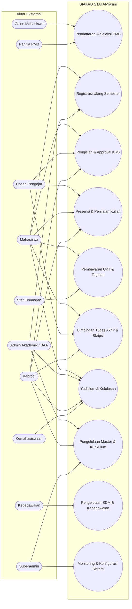
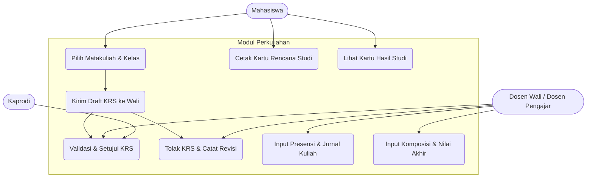
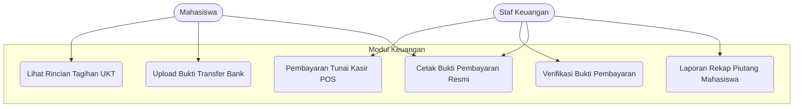

# Use Case Diagram & Skenario Spesifikasi SIAKAD STAI Al-Yasini
## Dokumentasi Resmi Perancangan Fungsional Sistem (*Single Source of Truth*)

Dokumen ini memuat perancangan **Use Case Diagram** dan **Skenario Use Case (*Use Case Specification*)** untuk 10 aktor peran (*role*) di lingkungan **SIAKAD STAI Al-Yasini Pasuruan**.

---

## 1. Identifikasi 10 Aktor Sistem

| No | Aktor | Tipe Aktor | Deskripsi Peran Utama |
| :---: | :--- | :--- | :--- |
| 1 | **Superadmin** | Administrator Sistem | Mengelola konfigurasi sistem, hak akses user, monitoring, & safeguard keamanan |
| 2 | **Admin Akademik (BAA)** | Operator Akademik | Mengelola master lembaga, kurikulum, plotting kelas, plotting dosen wali, & status mahasiswa |
| 3 | **Dosen Pengajar** | Tenaga Pendidik | Mengisi jurnal perkuliahan, presensi mahasiswa, input komposisi & nilai akhir perkuliahan |
| 4 | **Kaprodi (KPS)** | Pimpinan Prodi | Menetapkan kurikulum prodi, menyetujui KRS perwalian, memonitor nilai & kelulusan prodi |
| 5 | **Mahasiswa** | Civitas Akademika | Registrasi ulang semester, mengontrak KRS, memantau jadwal, presensi, KHS, & transkrip |
| 6 | **Calon Mahasiswa** | Publik / Pendaftar | Mengisi formulir PMB online, mengunggah berkas syarat, & memantau hasil seleksi |
| 7 | **Staf Keuangan** | Operator Keuangan | Menetapkan kelompok UKT, komponen tarif, melayani kasir POS, & rekap piutang |
| 8 | **Panitia PMB** | Panitia Penerimaan | Mengatur jalur & gelombang masuk, memvalidasi berkas calon maba, & input hasil ujian |
| 9 | **Staf Kepegawaian (SDM)** | Operator Kepegawaian | Mengelola data profil dosen/pegawai, unit kerja, jabatan fungsional, & sertifikasi |
| 10 | **Operator Kemahasiswaan** | Operator Bidikmisi | Mengelola pencatatan prestasi, beasiswa, pelanggaran tata tertib, & rekap aktivitas |

---

## 2. Diagram Use Case Global (Sistem SIAKAD)

---

## 3. Diagram Use Case Per Sub-Sistem

### A. Sub-Sistem Perwalian, KRS, & Perkuliahan

### B. Sub-Sistem Keuangan & Kasir

---

## 4. Skenario Use Case Spesifikasi (*Use Case Specification*)

### Skenario 1: Pengisian & Approval KRS Mahasiswa (UC-AKD-01)
- **Aktor Utama:** Mahasiswa, Dosen Wali (Dosen Pengajar / Kaprodi).
- **Kondisi Awal (*Pre-condition*):** Mahasiswa berstatus aktif, periode KRS semester dibuka, dan telah melunasi tagihan UKT prasyarat.
- **Alur Utama (*Normal Flow*):**
  1. Mahasiswa login ke SIAKAD dan memilih menu **KRS Saya**.
  2. Sistem menampilkan daftar mata kuliah yang ditawarkan pada semester aktif beserta kuota kelas.
  3. Mahasiswa memilih kelas matakuliah sesuai batas maksimal SKS yang diizinkan (berdasarkan IPS semester lalu).
  4. Mahasiswa menekan tombol **Ajukan KRS ke Dosen Wali**.
  5. Status KRS berubah menjadi `diajukan`.
  6. Dosen Wali membuka menu **Approval KRS Wali**.
  7. Dosen Wali memeriksa kesesuaian mata kuliah dan total SKS mahasiswa bimbingan.
  8. Dosen Wali menekan tombol **Setujui KRS**.
  9. Sistem memperbarui status KRS menjadi `disetujui`, menerbitkan data peserta ke daftar kelas kuliah, dan mengunci KRS.
  10. Mahasiswa dapat mengunduh dan mencetak form **KRS Resmi**.
- **Alur Alternatif (*Alternative Flow* - Revisi):**
  - Pada langkah 8, jika Dosen Wali menilai ada mata kuliah yang tidak sesuai:
    - Dosen Wali menekan tombol **Tolak KRS** dan mengisi pesan catatan penolakan.
    - Status KRS berubah menjadi `ditolak`.
    - Mahasiswa menerima notifikasi, memperbaiki pilihan mata kuliah, dan mengajukan ulang.
- **Kondisi Akhir (*Post-condition*):** Matakuliah resmi tercatat di riwayat studi mahasiswa dan masuk ke jurnal kelas dosen pengajar.

---

### Skenario 2: Input & Finalisasi Nilai Mahasiswa (UC-AKD-02)
- **Aktor Utama:** Dosen Pengajar.
- **Kondisi Awal (*Pre-condition*):** Kelas kuliah telah berjalan, dosen pengajar resmi terplot di kelas tersebut, dan masa penginputan nilai aktif.
- **Alur Utama (*Normal Flow*):**
  1. Dosen Pengajar login dan membuka menu **Penilaian Mahasiswa**.
  2. Dosen memilih kelas kuliah yang diampu.
  3. Dosen menetapkan bobot komposisi evaluasi (misal: Tugas 20%, Kehadiran 10%, UTS 30%, UAS 40%).
  4. Sistem menampilkan lembar nilai seluruh mahasiswa yang terdaftar di kelas tersebut.
  5. Dosen menginput nilai angka (0 - 100) untuk masing-masing komponen.
  6. Sistem secara otomatis menghitung Nilai Akhir (angka) dan mengonversinya ke Nilai Huruf (A, B, C, D, E) serta Indeks Bobot (4.00, 3.00, dst).
  7. Dosen menekan tombol **Finalisasi Nilai**.
  8. Sistem mengunci nilai agar tidak dapat diubah sembarangan dan mempublikasikannya ke Kartu Hasil Studi (KHS) mahasiswa.
- **Kondisi Akhir (*Post-condition*):** Nilai tersimpan permanen di tabel `nilais` dan indeks prestasi semester (IPS) mahasiswa otomatis terhitung.

---

### Skenario 3: Pendaftaran Calon Mahasiswa Baru (UC-PMB-01)
- **Aktor Utama:** Calon Mahasiswa, Panitia PMB.
- **Kondisi Awal (*Pre-condition*):** Gelombang pendaftaran PMB berstatus aktif.
- **Alur Utama (*Normal Flow*):**
  1. Calon Mahasiswa mengakses halaman publik `/pmb/daftar`.
  2. Calon Mahasiswa mengisi formulir identitas, NIK, asal sekolah, jalur seleksi, dan pilihan Program Studi.
  3. Sistem memvalidasi keunikan NIK (menggunakan *blind index*) dan membuat akun login calon maba.
  4. Calon Mahasiswa mengunggah berkas syarat (Ijazah/SKL, KTP, KK, Foto).
  5. Panitia PMB membuka menu **Calon Mahasiswa** di portal PMB.
  6. Panitia PMB memverifikasi keabsahan dokumen berkas yang diunggah.
  7. Panitia menginput nilai ujian seleksi dan mengubah status menjadi **Lulus Seleksi**.
  8. Calon Mahasiswa melihat pengumuman kelulusan di dashboard akunnya.
- **Kondisi Akhir (*Post-condition*):** Calon mahasiswa yang lulus dapat melanjutkan ke tahapan registrasi ulang dan penerbitan NIM.
