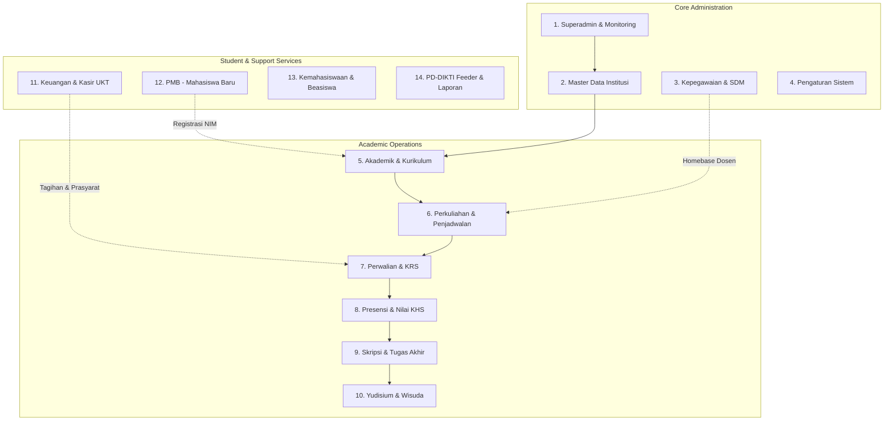

# 🏛️ Architectural Blueprint: Web-First, API-Ready Monolith
## Rencana Arsitektur & Transisi Bertahap Menuju Dukungan Mobile App

> **Versi Dokumen:** 1.0.0  
> **Tanggal:** 2026-09-05  
> **Arsitek:** Senior Software Architect & Senior Laravel Developer  
> **Prinsip Utama:** *"WEB FIRST, STABLE CORE, REUSABLE BUSINESS LOGIC, API-READY FOR FUTURE MOBILE"*  
> **Aturan Khusus:** Jangan membuat mobile app sekarang; jangan membuat API lengkap sekarang; selesaikan dan stabilkan Web terlebih dahulu.

---

## 1. Kondisi Arsitektur Saat Ini (Current Architecture State)

### 1.1 Pola Arsitektur Eksisting
* **Framework:** Laravel 13 + PHP 8.4 (ZTS / OPcache enabled)
* **Frontend:** Inertia.js v2/v3 + React 19 + TypeScript + Tailwind CSS v4 + Radix UI / Shadcn
* **Pola Interaksi:** Server-Driven UI (Monolith Inertia). Controller mengembalikan `Inertia::render('component', $props)`.
* **State & Session:** Database-driven sessions (`SESSION_DRIVER=database`), cache database (`CACHE_STORE=database`), dan queue database (`QUEUE_CONNECTION=database`).
* **Database Driver:** Multi-environment: MySQL 8.0 (Laragon Windows) & PostgreSQL (Docker / WSL).
* **Otorisasi:** Spatie Laravel-Permission (Role & Permission-based access control pada middleware route dan inline).

### 1.2 Temuan Audit Arsitektural

| Aspek | Kondisi Saat Ini | Temuan & Celah Arsitektural |
|---|---|---|
| **Controller Layer** | 49 Controller tersebar di 14 sub-namespace | Sebagian controller sudah memanggil Service (`KrsService`, `PresensiService`, `PaymentVerificationService`), namun sebagian lainnya masih memuat query kompleks dan mutasi database langsung (`KasirController`, `KelasKuliahController`, `MahasiswaPortalController`). |
| **Validation Layer** | Mayoritas inline `$request->validate([...])` | Hanya ada 1 Form Request di `app/Http/Requests/Settings/`. Validasi inline tidak dapat digunakan ulang (non-reusable) saat API endpoint dibuka nantinya. |
| **Service / Action Layer** | 16 Domain Services di `app/Services/` | Sudah ada fondasi service yang baik untuk KRS, Pembayaran, Presensi, dan Skripsi. Namun, query data portal mahasiswa/dosen masih melekat erat di controller Inertia. |
| **API Layer** | File `routes/api.php` **belum ada** | Belum ada token-based authentication (Sanctum), belum ada API Resources / Transformers, dan belum ada API versioning (`/api/v1`). |
| **View Coupling** | Terpisah via Inertia Props | Inertia mengembalikan data JSON terstruktur via props, sehingga business logic **tidak bergantung pada HTML rendering engine (Blade)**. Ini mempermudah transisi ke API di masa depan. |
| **Database Compatibility** | Ada sisa operator PostgreSQL (`ilike`) | Ditemukan sisa operator `ilike` di `KelasKuliahController` (lines 61-63), `DosenWaliController` (lines 43-44), dan `DataMahasiswaController` (lines 29-30) yang berisiko crash di MySQL Laragon jika dieksekusi fitur search-nya. |

---

## 2. Peta Seluruh Modul Existing (14 Modul)

Aplikasi memiliki **14 domain modul bisnis** yang melayani 10 peran pengguna resmi:



### Rincian Modul, Controller, dan Model:

1. **Superadmin & Monitoring**: `UserManagementController`, `MonitoringController`. (Model: `User`, `ActivityLog`, `Role`).
2. **Master Data Institusi**: `PerguruanTinggiController`, `FakultasController`, `ProgramStudiController`, `TahunAjaranController`, `RuangKuliahController`, `ReferensiBiodataController`, `KonsentrasiController`, `KalenderAkademikController`.
3. **Kepegawaian & SDM**: `UnitKerjaController`, `DosenManagementController`, `PegawaiManagementController`. (Model: `Dosen`, `Pegawai`, `UnitKerja`, `RiwayatPendidikanDosen`, `RiwayatJabatanFungsional`).
4. **Settings & Sistem**: `ProfileController`, `SecurityController`, `SystemConfigController`, `NotificationController`.
5. **Akademik & Kurikulum**: `KurikulumProdiController`, `MatakuliahController`, `SettingProdiController`. (Model: `KurikulumProdi`, `KurikulumMatakuliah`, `Matakuliah`, `PrasyaratMatakuliah`, `EkivalensiMatakuliah`).
6. **Perkuliahan & Penjadwalan**: `KelasKuliahController`. (Model: `KelasKuliah`, `JadwalPerkuliahan`, `DosenPengajar`, `RuangKuliah`).
7. **Perwalian & KRS**: `KrsController`, `DosenWaliController`. (Model: `Krs`, `KrsDetail`, `DosenWali`, `Cekal`).
8. **Presensi & Penilaian**: `PresensiController`, `PenilaianController`, `KhsController`. (Model: `JurnalPerkuliahan`, `Presensi`, `KomposisiNilai`, `Nilai`, `SkalaNilai`).
9. **Skripsi & Tugas Akhir**: `ProposalSkripsiController`, `SkripsiController`. (Model: `ProposalSkripsi`, `Skripsi`, `BimbinganProposal`, `BimbinganSkripsi`).
10. **Yudisium & Wisuda**: `YudisiumController`. (Model: `Yudisium`, `PeriodeWisuda`).
11. **Keuangan & Kasir UKT**: `KasirController`, `KelompokUktController`, `KomponenBiayaController`, `PeriodeRegistrasiController`, `RegistrasiUlangController`, `KeuanganController`. (Model: `Tagihan`, `Pembayaran`, `KelompokUkt`, `KomponenBiaya`, `CicilanTagihan`, `RegistrasiUlang`, `DokumenRegistrasi`).
12. **PMB (Penerimaan Mahasiswa Baru)**: `PmbPublicController`, `CalonMahasiswaController`, `GelombangPendaftaranController`, `JalurPendaftaranController`, `JadwalSeleksiController`, `HasilSeleksiController`.
13. **Kemahasiswaan**: `KemahasiswaanController`. (Model: `AktivitasMahasiswa`, `PelanggaranMahasiswa`, `BeasiswaMahasiswa`).
14. **Pelaporan & PD-DIKTI**: `LaporanController`, `DokumenAkademikController`, `PddiktiSyncController`.

---

## 3. Dependency Antar Modul

Arsitektur modul memiliki rantai ketergantungan (coupling) yang harus dijaga agar refaktor tidak memicu *cascading failures*:

1. **Keuangan ➔ KRS**: KRS Mahasiswa bergantung pada status pembayaran UKT (`KrsEligibilityService::evaluate`). Jika ada cekal keuangan atau UKT belum lunas, pendaftaran KRS terkunci.
2. **Master Data & Kurikulum ➔ Kelas Perkuliahan**: Kelas kuliah memerlukan Program Studi, Kurikulum Matakuliah, Dosen Homebase/Pengajar, dan Ruangan.
3. **Kelas Perkuliahan ➔ KRS**: Mahasiswa hanya dapat memilih kelas yang berstatus `isReadyForKrs()`.
4. **KRS Disetujui ➔ Presensi & Nilai**: Dosen hanya dapat mengabsen dan menilai mahasiswa yang KRS-nya telah berstatus `disetujui_wali`.
5. **Nilai KHS ➔ IPK / SKS Maksimal**: Perhitungan jatah SKS semester depan dihitung dari KHS semester sebelumnya (`KrsEligibilityService`).
6. **SKS Lulus & IPK ➔ Skripsi & Yudisium**: Mahasiswa hanya dapat mengajukan proposal skripsi dan yudisium jika memenuhi syarat minimum SKS lulus prodi.

---

## 4. Pemisahan Boundary: Web vs Future Mobile

Pemisahan ini adalah panduan strategis agar tim pengembang **tidak membangun fitur mobile untuk administrasi kompleks**, dan sebaliknya **tidak membebani mobile app dengan UI birokrasi kampus yang jarang dibuka lewat smartphone**.

```
+-----------------------------------------------------------------------------------+
|                            BOUNDARY ARSITEKTUR SISTEM                             |
+-----------------------------------------------------------------------------------+
|  💻 WEB-FIRST EXCLUSIVE DOMAIN (Administrasi & Tata Kelola Kampus)               |
|  - Konfigurasi Sistem Global (SystemConfig, Periode Akademik, Whitelist)          |
|  - Master Data Perguruan Tinggi, Fakultas, Program Studi, Ruang Kuliah            |
|  - Struktur Kurikulum, Ekivalensi, Matakuliah Prasyarat                           |
|  - Manajemen Akun, RBAC Spatie, Reset Password Massal, Impersonasi                |
|  - Kasir POS Pembayaran Offline, Verifikasi Pembayaran Manual, Generate UKT Batch |
|  - Plotting Dosen Wali, Rollover Wali, Penugasan Dosen Pengajar                   |
|  - Cetak Dokumen PDF Resmi Ber-Kop (Transkrip, KHS Resmi, Ijazah, SKPI)          |
|  - Integrasi Neo Feeder PD-DIKTI (Web Service Sync, Retry Queue, Rekonsiliasi)    |
|  - Laporan Eksekutif, Rekapitulasi Nilai Prodi, Piutang UKT Kampus               |
+-----------------------------------------------------------------------------------+
|  📱 FUTURE MOBILE DOMAIN (Aktivitas Harian / Daily Micro-Interactions)           |
|                                                                                   |
|  [Portal Mahasiswa]                                                              |
|  * Ringkasan Dashboard (IPK, SKS Tempuh, Status Akademik)                         |
|  * Jadwal Kuliah Mingguan & Pengingat Jam Kuliah                                  |
|  * Kartu Rencana Studi (KRS) Online: Pemilihan Kelas & Submit ke Wali             |
|  * Kartu Hasil Studi (KHS) & Riwayat Nilai Semester                               |
|  * Presensi Mandiri / Riwayat Kehadiran Perkuliahan                               |
|  * Rincian Tagihan UKT & Riwayat Pembayaran                                       |
|  * Notifikasi & Pengumuman Akademik / Kampus                                     |
|  * Profil Biodata Mahasiswa                                                       |
|                                                                                   |
|  [Portal Dosen]                                                                  |
|  * Jadwal Mengajar Harian                                                        |
|  * Presensi Perkuliahan (Input Jurnal & Absensi Mahasiswa)                        |
|  * Bimbingan & Approval KRS Mahasiswa Perwalian                                   |
|  * Input Nilai Perkuliahan Sederhana                                              |
|  * Notifikasi Pengajuan Bimbingan / Tugas Akhir                                  |
+-----------------------------------------------------------------------------------+
```

---

## 5. Target Kandidat API Endpoint (Mobile-Ready Foundation)

Ketika layer mobile mulai dibangun nanti, endpoint berikut akan mengonsumsi Service Layer yang sama dengan Controller Web:

### A. Mahasiswa Endpoints (`/api/v1/mahasiswa/*`)
* `GET  /api/v1/mahasiswa/profil` ➔ `MahasiswaPortalService::getProfile()`
* `GET  /api/v1/mahasiswa/jadwal` ➔ `MahasiswaPortalService::getWeeklySchedule()`
* `GET  /api/v1/mahasiswa/krs` ➔ `KrsService::getStudentKrsData()`
* `POST /api/v1/mahasiswa/krs/submit` ➔ `KrsService::submitKrs()`
* `GET  /api/v1/mahasiswa/khs` ➔ `KhsService::getStudentKhsData()`
* `GET  /api/v1/mahasiswa/presensi` ➔ `PresensiService::getStudentAttendanceSummary()`
* `GET  /api/v1/mahasiswa/tagihan` ➔ `KeuanganService::getStudentBillingHistory()`
* `GET  /api/v1/notifications` ➔ `NotificationService::getUserNotifications()`

### B. Dosen Endpoints (`/api/v1/dosen/*`)
* `GET  /api/v1/dosen/jadwal` ➔ `DosenPortalService::getTeachingSchedule()`
* `GET  /api/v1/dosen/kelas/{kelas}/presensi` ➔ `PresensiService::getClassAttendanceList()`
* `POST /api/v1/dosen/kelas/{kelas}/presensi` ➔ `PresensiService::recordJurnalAndPresensi()`
* `GET  /api/v1/dosen/perwalian/krs` ➔ `KrsService::getAdvisoryKrsList()`
* `POST /api/v1/dosen/perwalian/krs/{krs}/approve` ➔ `KrsService::approveKrs()`
* `POST /api/v1/dosen/perwalian/krs/{krs}/reject` ➔ `KrsService::rejectKrs()`
* `POST /api/v1/dosen/kelas/{kelas}/nilai` ➔ `PenilaianService::batchInputNilai()`

---

## 6. Rencana Refactoring: Controller ➔ Service & Form Request

Agar controller Web hanya bertanggung jawab pada HTTP Presentation (request handling & response rendering), refactoring dilakukan dengan aturan:
1. **Controller = Tipis (Skinny Controller)**. Hanya memanggil Form Request ➔ Service ➔ Response.
2. **Business Logic = Reusable Service / Action**. Menerima objek domain atau primitif tervalidasi, mengembalikan DTO atau model Eloquent.
3. **Validasi = Dedicated FormRequest**. Menghapus `$request->validate([...])` inline agar aturan validasi dapat diwariskan ke Web dan API.

```
[ Traditional Inline Controller ]
Request ──> [ Controller: Validasi + Business Logic + DB Transaction + Inertia Render ] ──> Response

[ Refactored Reusable Pattern ]
Request ──> [ FormRequest (Shared Validation Rules) ]
                     │
                     ▼
            [ Controller (Web/Inertia) ]  OR  [ API Controller (Future Mobile) ]
                     │                                   │
                     └───────────────┬───────────────────┘
                                     ▼
                      [ Domain Service / Action ]
                     (Pure Logic, DB, Events, Logs)
                                     │
                     ┌───────────────┴───────────────────┐
                     ▼                                   ▼
         [ Inertia Response (Web) ]           [ API Resource (Mobile) ]
```

---

## 7. Analisis Risiko & Mitigasi Migrasi

| Risiko | Tingkat Dampak | Strategi Mitigasi |
|---|:---:|---|
| **Regresi UI Web Eksisting** | 🔴 Tinggi | Dilarang mengubah prop signature pada Inertia Component. Output Service harus tetap kompatibel dengan struktur prop yang diharapkan komponen React saat ini. |
| **Auth Session vs Token Desynchronization** | 🟡 Sedang | Tetap gunakan Laravel Session untuk Web Inertia. Saat API dipersiapkan nanti, gunakan Laravel Sanctum Token khusus untuk request yang membawa header `Accept: application/json`. |
| **Pecahnya Relasi Database / Foreign Key** | 🔴 Tinggi | Seluruh query delete harus dibungkus guard relasi komprehensif (sebagaimana dirancang pada `TASK-008`). |
| **Double Validation Drift** | 🟡 Sedang | Jika Web dan API memakai file validasi berbeda, aturan bisnis bisa berbeda. Mitigasi: Gunakan Form Request tunggal yang menangani kedua platform. |

---

## 8. Urutan Implementasi Bertahap (6 Phase)

### Phase 1: Audit & Mapping Lengkap `[SELESAI - DOKUMEN INI]`
- [x] Pemetaan seluruh 49 controller, 64 model, dan 16 domain service.
- [x] Identifikasi batasan fitur Web-only vs Future Mobile.
- [x] Penyusunan blueprint arsitektur di `docs/WEB_FIRST_API_READY_PLAN.md`.

### Phase 2: Stabilisasi Fitur Web Prioritas Utama (Superadmin & Academic Core)
*Fokus: Memastikan seluruh fitur administratif Web bebas bug sebelum arsitektur diubah.*
- [x] Fix crash `ilike` pada modul Superadmin (`UserManagement`, `Monitoring`, `TahunAjaran`) — *Selesai di Phase 1 Superadmin*.
- [ ] Fix crash `ilike` pada modul Akademik (`KelasKuliahController`, `DosenWaliController`, `DataMahasiswaController`).
- [ ] Penyelesaian keputusan nama role resmi Kemahasiswaan & Kepegawaian (Phase 2 Superadmin).
- [ ] Implementasi fitur tertunda: Konsentrasi & Kalender Akademik (Phase 3 Superadmin).
- [ ] Verifikasi seluruh CRUD Web berfungsi normal tanpa error console/network.

### Phase 3: Ekstraksi Business Logic ke Service Layer
*Fokus: Mengeluarkan query dan mutasi dari controller ke service yang reusable.*
- [ ] Ekstraksi query portal mahasiswa (`MahasiswaPortalController`) ke `MahasiswaPortalService`.
- [ ] Ekstraksi transaksi kasir UKT (`KasirController::storePayment`) ke `PaymentService` / `KasirService`.
- [ ] Ekstraksi penjadwalan kelas dan dosen (`KelasKuliahController`) ke `KelasKuliahService`.
- [ ] Pastikan Web controller memanggil method service tersebut tanpa mengubah tampilan UI.

### Phase 4: Standardisasi Validasi & Otorisasi
*Fokus: Mengganti validasi inline menjadi FormRequest terstruktur.*
- [ ] Buat FormRequest untuk transaksi penting:
  - `StoreKrsRequest`, `StorePresensiRequest`, `StoreNilaiRequest`
  - `StorePaymentRequest`, `StoreUserRequest`, `StoreKelasKuliahRequest`
- [ ] Rapikan authorization policy untuk entitas mahasiswa dan dosen (mencegah akses data silang/IDOR).

### Phase 5: Persiapan Fondasi API Layer (API-Ready, Tanpa Membuat Mobile App)
*Fokus: Menyediakan fondasi standar tanpa over-engineering.*
- [ ] Install Laravel Sanctum untuk persiapan token auth masa depan (`php artisan install:api` jika disetujui).
- [ ] Buat API Resource Transformer untuk entitas utama:
  - `MahasiswaResource`, `JadwalKuliahResource`, `KrsResource`, `KhsResource`, `PresensiResource`, `TagihanResource`.
- [ ] Siapkan route skeleton `routes/api.php` dengan prefix `/api/v1` terproteksi auth sanctum (stubs / minimal).

### Phase 6: Regression Testing Menyeluruh
*Fokus: Memastikan stabilitas Web 100% sebelum rilis.*
- [ ] Menjalankan automated test suite (Pest / PHPUnit) untuk seluruh modul.
- [ ] Uji alur mahasiswa: Login ➔ Registrasi Ulang ➔ Bayar UKT ➔ KRS ➔ Presensi ➔ KHS.
- [ ] Uji alur dosen: Approval KRS ➔ Input Jurnal/Presensi ➔ Input Nilai.
- [ ] Uji alur admin: Master Data CRUD ➔ Kelas Kuliah ➔ Monitoring.
- [ ] Verifikasi build aset frontend: `npm run build` bebas error.
