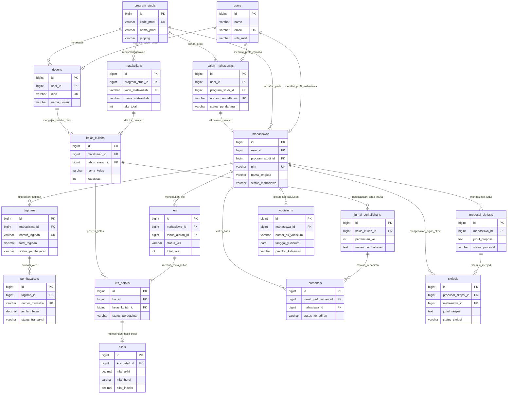

# High-Level Entity Relationship Diagram (Conceptual & Architectural ERD)
## Sistem Informasi Akademik (SIAKAD) STAI Al-Yasini

Dokumen ini menyajikan arsitektur database tingkat tinggi (*high-level conceptual / architectural view*) untuk memberikan pemahaman menyeluruh terhadap integrasi data antar-domain bisnis pada SIAKAD STAI Al-Yasini.

---

## 1. Diagram Integrasi Lintas Domain Utama (Mermaid)

Diagram di bawah ini menggambarkan interaksi antara entitas jangkar (*anchor entities*) dari setiap domain utama:

---

## 2. Alur Interaksi Antar Domain Bisnis

### A. Siklus Masuk & Konversi (PMB -> Keuangan -> Master Mahasiswa)
1. Calon mahasiswa mendaftar pada portal PMB (`calon_mahasiswas`), memilih `program_studis`, dan mengunggah berkas.
2. Setelah dinyatakan lulus tes seleksi, calon mahasiswa melakukan her-registrasi dan pembayaran biaya awal.
3. Melalui `RegistrasiUlangService`, data calon mahasiswa dikonversi menjadi record resmi `mahasiswas`, dan diterbitkan akun pengguna (`users`) serta Nomor Induk Mahasiswa (NIM).

### B. Siklus Registrasi Semester (Keuangan -> Akademik KRS)
1. Pada awal semester baru, sistem keuangan (`tagihans`) menerbitkan invoice UKT berdasarkan tarif `kelompok_ukts` atau pembebasan bagi penerima `beasiswa_mahasiswas`.
2. Setelah transaksi kasir POS atau verifikasi transfer lunas (`pembayarans`), sistem membuka hak akses pengisian KRS online (`krs`).
3. Mahasiswa mengontrak kelas matakuliah (`kelas_kuliahs`) ke dalam `krs_details`, lalu dosen wali mengevaluasi dan memberikan persetujuan (*approved*).

### C. Siklus Perkuliahan & Penilaian (Akademik -> Presensi -> KHS)
1. Dosen mengajar kelas dan mengisi jurnal tatap muka 1-16 pertemuan (`jurnal_perkuliahans`).
2. Kehadiran mahasiswa dicatat per pertemuan (`presensis`). Persentase kehadiran menjadi syarat kelayakan mengikuti UTS ($\ge 50\%$) dan UAS ($\ge 75\%$).
3. Dosen menginput nilai komponen tugas, UTS, dan UAS. Sistem secara otomatis mengkalkulasi nilai angka, huruf mutu, dan bobot indeks ke dalam tabel `nilais` untuk menerbitkan Kartu Hasil Studi (KHS).

### D. Siklus Tugas Akhir & Kelulusan (Skripsi -> Yudisium -> Alumni)
1. Mahasiswa yang telah menempuh minimal 100 SKS mengajukan judul pada `proposal_skripsis`.
2. Setelah disetujui Kaprodi dan melalui seminar proposal, proposal naik status menjadi naskah `skripsis`.
3. Mahasiswa melakukan bimbingan rutin (minimal 8 sesi log) sebelum diuji pada sidang munaqasyah dewan penguji.
4. Mahasiswa yang lulus sidang dan menyelesaikan audit bebas tanggungan akademik/keuangan didaftarkan ke sidang `yudisiums` untuk penetapan SK Yudisium, IPK akhir, serta penjadwalan wisuda sarjana.

---
*Dokumentasi disusun oleh Senior Database Architect SIAKAD STAI Al-Yasini.*