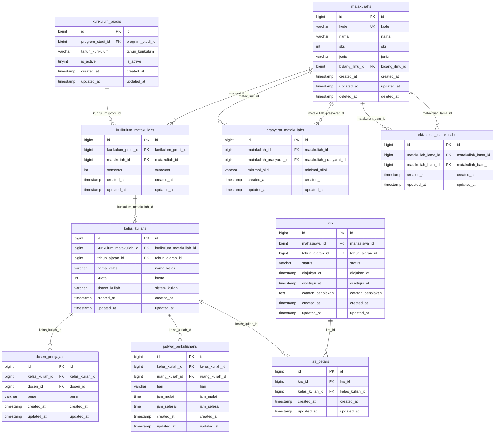

# Domain ERD: Akademik, Kurikulum & Kontrak Studi (KRS)

## 1. Deskripsi Domain
Dokumentasi ERD untuk struktur kurikulum prodi, matakuliah, prasyarat matakuliah, ekivalensi kurikulum lama-baru, pembagian kelas perkuliahan, penugasan dosen pengajar, jadwal kuliah mingguan, kontrak rencana studi (KRS) mahasiswa, dan detail KRS per matakuliah.

## 2. Diagram ERD (Crow's Foot Notation)

## 3. Inventarisasi Tabel Domain

| Nama Tabel | Total Kolom | Primary Key | Total FK | Keterangan Fungsi |
|---|---|---|---|---|
| `kurikulum_prodis` | 6 | `id` | 1 | Tabel operasional modul kurikulum prodis |
| `matakuliahs` | 9 | `id` | 1 | Tabel operasional modul matakuliahs |
| `kurikulum_matakuliahs` | 6 | `id` | 2 | Tabel operasional modul kurikulum matakuliahs |
| `prasyarat_matakuliahs` | 6 | `id` | 2 | Tabel operasional modul prasyarat matakuliahs |
| `ekivalensi_matakuliahs` | 5 | `id` | 2 | Tabel operasional modul ekivalensi matakuliahs |
| `kelas_kuliahs` | 8 | `id` | 2 | Tabel operasional modul kelas kuliahs |
| `dosen_pengajars` | 6 | `id` | 2 | Tabel operasional modul dosen pengajars |
| `jadwal_perkuliahans` | 8 | `id` | 2 | Tabel operasional modul jadwal perkuliahans |
| `krs` | 9 | `id` | 2 | Tabel operasional modul krs |
| `krs_details` | 5 | `id` | 2 | Tabel operasional modul krs details |

---
*Dokumentasi ini digenerate secara otomatis berdasarkan skema database fisik aktif `siakad_db`.*
