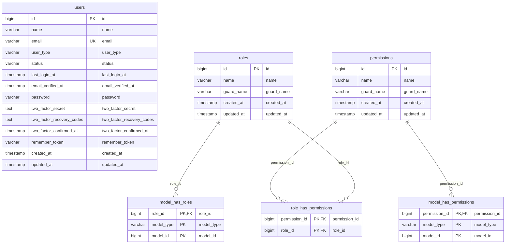

# Domain ERD: Authentication & Role-Based Access Control (RBAC)

## 1. Deskripsi Domain
Dokumentasi ERD untuk manajemen autentikasi pengguna (Laravel Fortify, Two-Factor Authentication, Session Management) dan otorisasi hak akses peran (Spatie Laravel Permission).

## 2. Diagram ERD (Crow's Foot Notation)

## 3. Inventarisasi Tabel Domain

| Nama Tabel | Total Kolom | Primary Key | Total FK | Keterangan Fungsi |
|---|---|---|---|---|
| `users` | 14 | `id` | 0 | Tabel operasional modul users |
| `roles` | 5 | `id` | 0 | Tabel operasional modul roles |
| `permissions` | 5 | `id` | 0 | Tabel operasional modul permissions |
| `model_has_roles` | 3 | `role_id` | 1 | Tabel operasional modul model has roles |
| `model_has_permissions` | 3 | `permission_id` | 1 | Tabel operasional modul model has permissions |
| `role_has_permissions` | 2 | `permission_id` | 2 | Tabel operasional modul role has permissions |

---
*Dokumentasi ini digenerate secara otomatis berdasarkan skema database fisik aktif `siakad_db`.*
