# Domain ERD: Master Data Institusi & Akademik

## 1. Deskripsi Domain
Dokumentasi ERD untuk data master kelembagaan kampus STAI Al-Yasini (Perguruan Tinggi, Fakultas, Program Studi, Konsentrasi, Setting Prodi, Tahun Ajaran, Ruang Perkuliahan, Skala Penilaian, Kalender Akademik, Wilayah, dan Referensi Biodata).

## 2. Diagram ERD (Crow's Foot Notation)

```mermaid
erDiagram
    perguruan_tinggis {
        bigint id PK "id"
        varchar kode_unit "kode_unit"
        varchar nama_unit "nama_unit"
        varchar nama_unit_en "nama_unit_en"
        varchar nama_singkat "nama_singkat"
        varchar jenis_perguruan_tinggi "jenis_perguruan_tinggi"
        varchar lembaga_naungan "lembaga_naungan"
        varchar periode_berdiri "periode_berdiri"
        varchar no_sk_pendirian "no_sk_pendirian"
        date tanggal_sk_pendirian "tanggal_sk_pendirian"
        varchar ketua_nama "ketua_nama"
        varchar ketua_nidn "ketua_nidn"
        varchar wakil_ketua_1 "wakil_ketua_1"
        varchar wakil_ketua_2 "wakil_ketua_2"
        varchar wakil_ketua_3 "wakil_ketua_3"
        varchar wakil_ketua_4 "wakil_ketua_4"
        varchar lembaga_akreditasi "lembaga_akreditasi"
        varchar peringkat_akreditasi "peringkat_akreditasi"
        varchar nilai_akreditasi "nilai_akreditasi"
        varchar no_sk_akreditasi "no_sk_akreditasi"
        date tanggal_sk_akreditasi "tanggal_sk_akreditasi"
        date tanggal_berlaku_akreditasi "tanggal_berlaku_akreditasi"
        date tanggal_berakhir_akreditasi "tanggal_berakhir_akreditasi"
        varchar file_sertifikat_akreditasi "file_sertifikat_akreditasi"
        text visi "visi"
        text misi "misi"
        varchar alamat "alamat"
        varchar telepon "telepon"
        varchar email "email"
        varchar website "website"
        varchar fax "fax"
        timestamp created_at "created_at"
        timestamp updated_at "updated_at"
    }
    fakultas {
        bigint id PK "id"
        varchar kode UK "kode"
        varchar nama "nama"
        varchar nama_en "nama_en"
        varchar nama_singkat "nama_singkat"
        varchar alamat "alamat"
        varchar telepon "telepon"
        int tahun_berdiri "tahun_berdiri"
        varchar periode_berdiri "periode_berdiri"
        varchar status "status"
        varchar luas_m2 "luas_m2"
        varchar dekan_nama "dekan_nama"
        varchar dekan_nidn "dekan_nidn"
        varchar wakil_dekan_1 "wakil_dekan_1"
        varchar wakil_dekan_2 "wakil_dekan_2"
        varchar wakil_dekan_3 "wakil_dekan_3"
        varchar wakil_dekan_4 "wakil_dekan_4"
        text visi "visi"
        text misi "misi"
        timestamp created_at "created_at"
        timestamp updated_at "updated_at"
        timestamp deleted_at "deleted_at"
    }
    program_studis {
        bigint id PK "id"
        bigint fakultas_id FK "fakultas_id"
        varchar kode UK "kode"
        varchar nama "nama"
        varchar nama_en "nama_en"
        varchar nama_singkat "nama_singkat"
        varchar periode_berdiri "periode_berdiri"
        varchar jenjang "jenjang"
        varchar gelar "gelar"
        varchar gelar_singkat "gelar_singkat"
        varchar gelar_en "gelar_en"
        varchar gelar_singkat_en "gelar_singkat_en"
        varchar status "status"
        varchar status_spmb "status_spmb"
        tinyint terdaftar_lptk "terdaftar_lptk"
        varchar ketua_prodi_nama "ketua_prodi_nama"
        varchar ketua_prodi_nidn "ketua_prodi_nidn"
        varchar sekretaris_prodi_nama "sekretaris_prodi_nama"
        int sks_lulus_min "sks_lulus_min"
        decimal ipk_lulus_min "ipk_lulus_min"
        tinyint tugas_akhir_syarat "tugas_akhir_syarat"
        varchar jenis_tugas_akhir "jenis_tugas_akhir"
        varchar pengaturan_transfer_nilai "pengaturan_transfer_nilai"
        int max_dosen_pembimbing "max_dosen_pembimbing"
        int max_dosen_penguji "max_dosen_penguji"
        varchar periode_hitung_ips "periode_hitung_ips"
        varchar lembaga_akreditasi "lembaga_akreditasi"
        varchar akreditasi "akreditasi"
        varchar nilai_akreditasi "nilai_akreditasi"
        varchar no_sk_akreditasi "no_sk_akreditasi"
        date tanggal_sk_akreditasi "tanggal_sk_akreditasi"
        date tanggal_berlaku_akreditasi "tanggal_berlaku_akreditasi"
        date tanggal_berakhir_akreditasi "tanggal_berakhir_akreditasi"
        varchar file_sertifikat_akreditasi "file_sertifikat_akreditasi"
        varchar alamat "alamat"
        varchar telepon "telepon"
        varchar email "email"
        varchar website "website"
        timestamp created_at "created_at"
        timestamp updated_at "updated_at"
        timestamp deleted_at "deleted_at"
    }
    setting_prodis {
        bigint id PK "id"
        bigint tahun_ajaran_id FK "tahun_ajaran_id"
        bigint program_studi_id FK "program_studi_id"
        bigint kurikulum_id FK "kurikulum_id"
        tinyint buka_krs "buka_krs"
        date tgl_awal_krs "tgl_awal_krs"
        date tgl_akhir_krs "tgl_akhir_krs"
        date tgl_cetak_krs "tgl_cetak_krs"
        tinyint buka_validasi_krs "buka_validasi_krs"
        date tgl_awal_validasi_krs "tgl_awal_validasi_krs"
        date tgl_akhir_validasi_krs "tgl_akhir_validasi_krs"
        tinyint dosen_tampil_di_krs "dosen_tampil_di_krs"
        tinyint buka_cetak_krs "buka_cetak_krs"
        tinyint buka_khs "buka_khs"
        date tgl_awal_khs "tgl_awal_khs"
        date tgl_akhir_khs "tgl_akhir_khs"
        date tgl_cetak_khs "tgl_cetak_khs"
        tinyint buka_pengisian_nilai "buka_pengisian_nilai"
        tinyint dosen_isi_persentase_komponen "dosen_isi_persentase_komponen"
        date tgl_awal_pengisian_nilai "tgl_awal_pengisian_nilai"
        date tgl_akhir_pengisian_nilai "tgl_akhir_pengisian_nilai"
        tinyint buka_cetak_uts "buka_cetak_uts"
        date tgl_awal_cetak_uts "tgl_awal_cetak_uts"
        date tgl_akhir_cetak_uts "tgl_akhir_cetak_uts"
        date tgl_cetak_uts "tgl_cetak_uts"
        int min_presensi_uts "min_presensi_uts"
        int min_presensi_uas "min_presensi_uas"
        tinyint buka_cetak_uas "buka_cetak_uas"
        date tgl_awal_cetak_uas "tgl_awal_cetak_uas"
        date tgl_akhir_cetak_uas "tgl_akhir_cetak_uas"
        date tgl_cetak_uas "tgl_cetak_uas"
        tinyint buka_ubah_biodata "buka_ubah_biodata"
        tinyint buka_kuesioner "buka_kuesioner"
        date tgl_awal_kuesioner "tgl_awal_kuesioner"
        date tgl_akhir_kuesioner "tgl_akhir_kuesioner"
        tinyint dosen_generate_tatap_muka "dosen_generate_tatap_muka"
        int jumlah_pertemuan_kuliah "jumlah_pertemuan_kuliah"
        int batas_waktu_perubahan_presensi_hari "batas_waktu_perubahan_presensi_hari"
        tinyint buka_setting_ketua_kelas "buka_setting_ketua_kelas"
        timestamp created_at "created_at"
        timestamp updated_at "updated_at"
    }
    konsentrasis {
        bigint id PK "id"
        bigint program_studi_id FK "program_studi_id"
        varchar nama "nama"
        timestamp created_at "created_at"
        timestamp updated_at "updated_at"
        timestamp deleted_at "deleted_at"
    }
    tahun_ajarans {
        bigint id PK "id"
        varchar nama "nama"
        date mulai "mulai"
        date selesai "selesai"
        tinyint is_active "is_active"
        date krs_mulai "krs_mulai"
        date krs_selesai "krs_selesai"
        date krs_batal_tambah_mulai "krs_batal_tambah_mulai"
        date krs_batal_tambah_selesai "krs_batal_tambah_selesai"
        date penilaian_mulai "penilaian_mulai"
        date penilaian_selesai "penilaian_selesai"
        date pembayaran_mulai "pembayaran_mulai"
        date pembayaran_selesai "pembayaran_selesai"
        date uts_mulai "uts_mulai"
        date uts_selesai "uts_selesai"
        date uas_mulai "uas_mulai"
        date uas_selesai "uas_selesai"
        timestamp created_at "created_at"
        timestamp updated_at "updated_at"
    }
    ruang_kuliahs {
        bigint id PK "id"
        varchar kode UK "kode"
        varchar nama "nama"
        int kapasitas "kapasitas"
        timestamp created_at "created_at"
        timestamp updated_at "updated_at"
    }
    skala_nilais {
        bigint id PK "id"
        decimal min_angka "min_angka"
        decimal max_angka "max_angka"
        varchar huruf "huruf"
        decimal bobot "bobot"
        timestamp created_at "created_at"
        timestamp updated_at "updated_at"
    }
    kalender_akademiks {
        bigint id PK "id"
        bigint tahun_ajaran_id FK "tahun_ajaran_id"
        varchar kegiatan "kegiatan"
        date mulai "mulai"
        date selesai "selesai"
        timestamp created_at "created_at"
        timestamp updated_at "updated_at"
    }
    wilayahs {
        bigint id PK "id"
        varchar kode UK "kode"
        varchar nama "nama"
        int level "level"
        bigint parent_id FK "parent_id"
        varchar pddikti_ref_id "pddikti_ref_id"
        timestamp created_at "created_at"
        timestamp updated_at "updated_at"
    }
    referensi_biodatas {
        bigint id PK "id"
        varchar tipe "tipe"
        varchar nama "nama"
        varchar pddikti_ref_id "pddikti_ref_id"
        timestamp created_at "created_at"
        timestamp updated_at "updated_at"
    }
    fakultas ||--o{ program_studis : "fakultas_id"
    program_studis |o--o{ setting_prodis : "program_studi_id"
    tahun_ajarans ||--o{ setting_prodis : "tahun_ajaran_id"
    program_studis ||--o{ konsentrasis : "program_studi_id"
    tahun_ajarans ||--o{ kalender_akademiks : "tahun_ajaran_id"
    wilayahs |o--o{ wilayahs : "parent_id"
```

## 3. Inventarisasi Tabel Domain

| Nama Tabel | Total Kolom | Primary Key | Total FK | Keterangan Fungsi |
|---|---|---|---|---|
| `perguruan_tinggis` | 33 | `id` | 0 | Tabel operasional modul perguruan tinggis |
| `fakultas` | 22 | `id` | 0 | Tabel operasional modul fakultas |
| `program_studis` | 41 | `id` | 1 | Tabel operasional modul program studis |
| `setting_prodis` | 41 | `id` | 3 | Tabel operasional modul setting prodis |
| `konsentrasis` | 6 | `id` | 1 | Tabel operasional modul konsentrasis |
| `tahun_ajarans` | 19 | `id` | 0 | Tabel operasional modul tahun ajarans |
| `ruang_kuliahs` | 6 | `id` | 0 | Tabel operasional modul ruang kuliahs |
| `skala_nilais` | 7 | `id` | 0 | Tabel operasional modul skala nilais |
| `kalender_akademiks` | 7 | `id` | 1 | Tabel operasional modul kalender akademiks |
| `wilayahs` | 8 | `id` | 1 | Tabel operasional modul wilayahs |
| `referensi_biodatas` | 6 | `id` | 0 | Tabel operasional modul referensi biodatas |

---
*Dokumentasi ini digenerate secara otomatis berdasarkan skema database fisik aktif `siakad_db`.*
