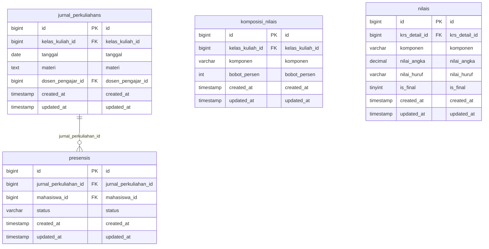

# Domain ERD: Presensi Perkuliahan & Penilaian Akademik

## 1. Deskripsi Domain
Dokumentasi ERD untuk pencatatan 16 sesi tatap muka perkuliahan (jurnal dosen & materi), presensi kehadiran mahasiswa per pertemuan, konfigurasi persentase bobot komposisi nilai (tugas, kuis, UTS, UAS, kehadiran), dan nilai akhir mahasiswa (KHS).

## 2. Diagram ERD (Crow's Foot Notation)

## 3. Inventarisasi Tabel Domain

| Nama Tabel | Total Kolom | Primary Key | Total FK | Keterangan Fungsi |
|---|---|---|---|---|
| `jurnal_perkuliahans` | 7 | `id` | 2 | Tabel operasional modul jurnal perkuliahans |
| `presensis` | 6 | `id` | 2 | Tabel operasional modul presensis |
| `komposisi_nilais` | 6 | `id` | 1 | Tabel operasional modul komposisi nilais |
| `nilais` | 8 | `id` | 1 | Tabel operasional modul nilais |

---
*Dokumentasi ini digenerate secara otomatis berdasarkan skema database fisik aktif `siakad_db`.*
