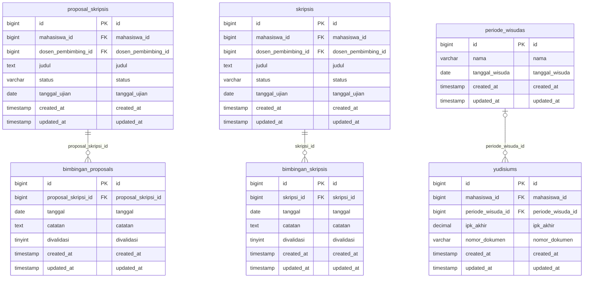

# Domain ERD: Tugas Akhir, Skripsi, Munaqasyah & Yudisium

## 1. Deskripsi Domain
Dokumentasi ERD untuk siklus penyelesaian studi akhir: pengajuan dan verifikasi proposal skripsi, bimbingan proposal, penetapan dosen pembimbing skripsi, log asistensi/bimbingan rutin (minimal 8 log), sidang munaqasyah, audit bebas tanggungan akademik/keuangan, penetapan SK Yudisium, dan penjadwalan periode wisuda.

## 2. Diagram ERD (Crow's Foot Notation)

## 3. Inventarisasi Tabel Domain

| Nama Tabel | Total Kolom | Primary Key | Total FK | Keterangan Fungsi |
|---|---|---|---|---|
| `proposal_skripsis` | 8 | `id` | 2 | Tabel operasional modul proposal skripsis |
| `bimbingan_proposals` | 7 | `id` | 1 | Tabel operasional modul bimbingan proposals |
| `skripsis` | 8 | `id` | 2 | Tabel operasional modul skripsis |
| `bimbingan_skripsis` | 7 | `id` | 1 | Tabel operasional modul bimbingan skripsis |
| `yudisiums` | 7 | `id` | 2 | Tabel operasional modul yudisiums |
| `periode_wisudas` | 5 | `id` | 0 | Tabel operasional modul periode wisudas |

---
*Dokumentasi ini digenerate secara otomatis berdasarkan skema database fisik aktif `siakad_db`.*
